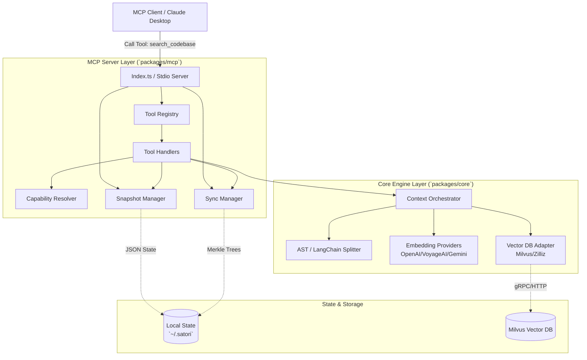
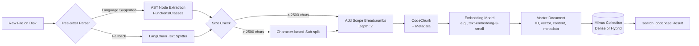

# Satori Architecture

Visual-first architecture summary for the `satori` monorepo. Satori means "sudden insight"; this architecture is designed to deliver that insight with strict safety and predictable agent behavior.

> **Architected by:** Hamza (@ham-zax)

---

## 1. Macro System Flow
This diagram illustrates the macro-level request lifecycle, from the MCP Client, through the Satori internal handlers and capability resolvers, down to the Core Engine and local state.


*Explanation:* The architecture is cleanly decoupled. The MCP server layer handles tool registration, telemetry, capability throttling, and state routing (snapshots). It passes clean inputs to the Core layer, which acts as a library orchestrating splitting, embedding, and vector insertion.

---

## 2. Snapshot State Machine
This diagram maps the strict lifecycle of a codebase index within Satori, preventing autonomous agents from acting on corrupted or mismatched data.


*Explanation:* The core safety mechanism of Satori. Autonomous agents run into the `requires_reindex` gate immediately if the server starts with a different configuration (e.g., switching from OpenAI 1536-dim to Gemini 768-dim) than what is persisted in `~/.satori/mcp-codebase-snapshot.json`.

---

## 3. Data Lineage Pipeline
This diagram traces how a raw file on disk is transformed into searchable semantic chunks using Tree-sitter and embedding models.


*Explanation:* Satori prioritizes structural chunking. Tree-sitter extracts logical units (like methods or classes). If a unit is massive, it splits character-by-character but crucially retains the "Scope Breadcrumbs" (e.g., `class UserService > method updateUserProfile`) so the LLM understands exactly where the chunk came from, even if it lacks surrounding code.

---

## 4. Text-Based System Overview

```text
MCP Client
  |
  v
+---------------------------------------------------------------+
| MCP Server (`packages/mcp`)                                  |
|  - Tool Registry (4 tools)                                   |
|  - ToolHandlers                                               |
|  - CapabilityResolver                                         |
|  - SnapshotManager / SyncManager                              |
+---------------------------+-----------------------------------+
                            |
                            v
+---------------------------------------------------------------+
| Core Engine (`packages/core`)                                |
|  - Context orchestrator                                      |
|  - Splitter (AST + LangChain fallback)                       |
|  - Embedding providers                                       |
|  - Vector DB adapters (Milvus gRPC / REST)                   |
+---------------------+----------------------+------------------+
                      |                      |
                      v                      v
      +------------------------------+   +----------------------+
      | `~/.satori` local state      |   | Milvus / Zilliz      |
      | snapshot + merkle sync files |   | dense/hybrid indexes |
      +------------------------------+   +----------------------+
```

Control/state paths:
- `~/.satori/mcp-codebase-snapshot.json`
- `~/.satori/merkle/<md5(codebasePath)>.json`

## 5. Incremental Sync (Core)

`FileSynchronizer` keeps file hashes + Merkle DAG per codebase and returns:
- `added`
- `removed`
- `modified`

`reindexByChange` behavior:
- removed/modified -> delete old chunks
- added/modified -> re-index

## 6. Snapshot and Gate Model

Gate reasons:
- legacy assumed fingerprint
- missing fingerprint
- fingerprint mismatch

## 7. Capability Model

```text
Embedding locality/profile:
  Ollama              -> local / slow
  VoyageAI or OpenAI  -> cloud / fast
  others              -> cloud / standard

Search limits:
  fast     default 50, max 50
  standard default 25, max 30
  slow     default 10, max 15
```

Rerank decision:
- `useReranker=true` -> force (error if unavailable)
- `useReranker=false` -> disable
- omitted -> capability-driven default