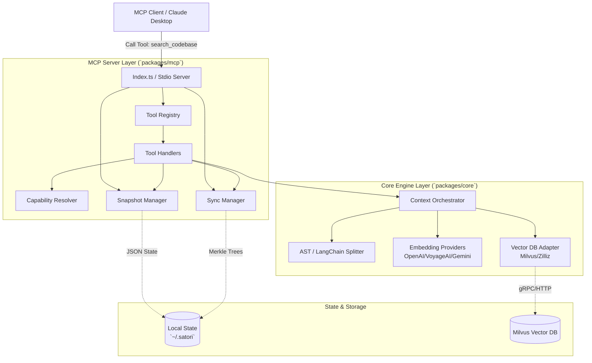
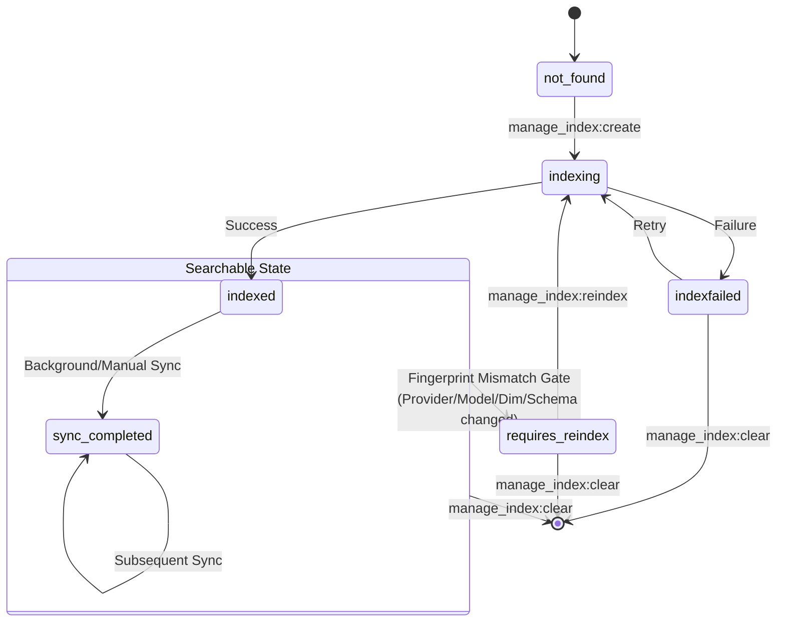
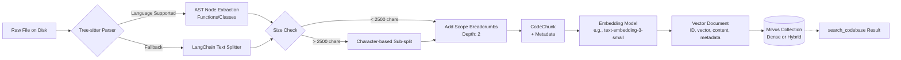

# Satori Architecture

This document explains how Satori handles indexing, search, and sync in production MCP workflows.

---

## 1. Macro System Flow
This diagram shows the request path from MCP client to server runtime, then into the core engine and storage layers.


*Explanation:* Responsibilities are separated on purpose. The MCP layer handles tool routing, capability decisions, telemetry, and snapshot state. The core layer handles chunking, embedding, and vector operations.

---

## 2. Snapshot State Machine
This diagram shows the codebase lifecycle and the `requires_reindex` gate that blocks mismatched or legacy index states.


*Explanation:* This is the main safety barrier. If runtime configuration differs from the stored snapshot fingerprint (for example, OpenAI 1536-dim to Gemini 768-dim), searchable access is blocked until reindex.

---

## 3. Data Lineage Pipeline
This diagram traces how a file on disk becomes searchable chunks in Milvus.


*Explanation:* Satori prioritizes structural chunking. Tree-sitter extracts methods/classes first. If a unit is too large, it is sub-split while retaining scope breadcrumbs (for example, `class UserService > method updateUserProfile`) so results stay anchored.

---

## 4. Text-Based System Overview

```text
MCP Client
  |
  v
+---------------------------------------------------------------+
| MCP Server (`packages/mcp`)                                  |
|  - Tool Registry (5 tools)                                   |
|    manage_index, search_codebase, call_graph, read_file, list_codebases |
|  - ToolHandlers                                               |
|  - CapabilityResolver                                         |
|  - SnapshotManager / SyncManager                              |
+---------------------------+-----------------------------------+
                            |
                            v
+---------------------------------------------------------------+
| Core Engine (`packages/core`)                                |
|  - Context orchestrator                                      |
|  - Splitter (AST + LangChain fallback)                       |
|  - Embedding providers                                       |
|  - Vector DB adapters (Milvus gRPC / REST)                   |
+---------------------+----------------------+------------------+
                      |                      |
                      v                      v
      +------------------------------+   +----------------------+
      | `~/.satori` local state      |   | Milvus / Zilliz      |
      | snapshot + merkle sync files |   | dense/hybrid indexes |
      +------------------------------+   +----------------------+
```

Operational note: on Zilliz Cloud (Milvus) free tier, Satori can index up to 5 codebases (one collection per codebase).

Control/state paths:
- `~/.satori/mcp-codebase-snapshot.json`
- `~/.satori/merkle/<md5(codebasePath)>.json`

## 5. Incremental Sync (Core)

`FileSynchronizer` keeps file hashes + Merkle DAG per codebase and returns:
- `added`
- `removed`
- `modified`

`reindexByChange` behavior:
- removed/modified -> delete old chunks
- added/modified -> re-index

## 6. Snapshot and Gate Model

Gate reasons:
- legacy assumed fingerprint
- missing fingerprint
- fingerprint mismatch

## 7. Search + Call Graph Contract

`search_codebase` now uses explicit runtime-first controls:
- `scope`: `runtime | mixed | docs`
- `resultMode`: `grouped | raw`
- `groupBy`: `symbol | file`
- `limit`: max groups (grouped) or max chunks (raw)
- optional `debug`: ranking breakdowns/traces

Grouped search output includes:
- stable `groupId`
- `symbolId` / `symbolLabel` (nullable when metadata is missing)
- `indexedAt` (aggregated max), `stalenessBucket`, `collapsedChunkCount`
- `callGraphHint` discriminated union (`supported: true|false`)

`call_graph` is first-class and consumes `callGraphHint.symbolRef`:
- TS/Python supported
- deterministic ordering for nodes/edges/notes
- structured unsupported/not_found/requires_reindex responses

## 8. Capability Model

```text
Embedding locality/profile:
  Ollama              -> local / slow
  VoyageAI or OpenAI  -> cloud / fast
  others              -> cloud / standard

Search limits:
  fast     default 50, max 50
  standard default 25, max 30
  slow     default 10, max 15
```

Rerank decision is internal and profile-driven. The public `search_codebase` contract no longer exposes `useReranker`.
