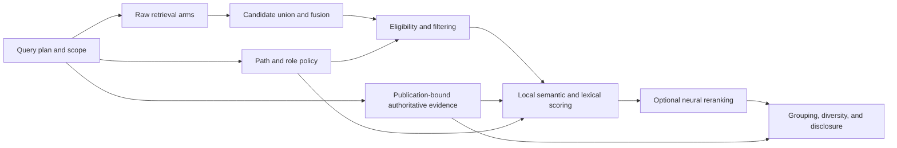

# Satori Cross-Repository Ranking Ablation Plan

**Status:** complete. R2 retained baseline `B`; the corrected retrieval
baseline passed; LateOn C0 FP32 conformance passed; R3 found directional quality
improvement but no contender passed both the originally frozen quality and
resource gates. R4 finalist qualification and R5 held-out adjudication were not
admitted under that contract.

**Date:** 2026-07-29
**Completed:** 2026-07-30

**Original terminal decision:** retain product policy `B`. No LateOn finalist
was admitted under the original resource contract. Held-out evidence remains
sealed.

**Authorized follow-up:** the later empirical local-WSL runtime experiment
replaced the assumed 512 MiB gate, removed cross-document padding amplification,
and reproduced every qualified D-L16 score and ranking order. Its measured
profile admits D-L16 for a separate production implementation while leaving
this plan's frozen quality evidence unchanged:

```text
docs/evidence/lateon-runtime-profile-20260730/LATEON_RUNTIME_PROFILE_RECEIPT.md
```

Final evidence:

```text
docs/evidence/lateon-r3-diagnostic-20260730/LATEON_R3_DIAGNOSTIC_RECEIPT.md
docs/evidence/lateon-r3-diagnostic-20260730/lateon-r3-diagnostic-artifacts.tar.gz
```

## 1. Purpose

Determine from frozen tuning and held-out evidence whether Satori should:

* retain its current ranking policy;
* weaken or condition global path policy;
* extend bounded authoritative evidence;
* qualify LateOn as an offline query-time reranker;
* investigate first-stage retrieval or representation; or
* make no product change.

No winner is preselected. Owner-aware ranking, neutral paths, bounded paths,
Voyage, and LateOn are hypotheses that must compete without changing the
candidate evidence available to another arm.

This plan owns cross-repository benchmark construction, stage localization,
ranking ablations, counterfactual tests, and the resulting routing decision. It
does not duplicate the established lifecycle owners below.

| Decision | Existing authority |
| --- | --- |
| Expanded release and production admission | Track B of `SATORI_OFFLINE_SEARCH_PRODUCTIZATION_AND_QUALITY_FOLLOW_UP_PLAN.md` |
| LateOn artifact, runtime, prototype, cache, and sidecar qualification | Existing Track C0--C4 |
| Alternative first-stage embeddings or representation | Existing Track F |
| Semantic abstention or public no-answer behavior | `SEMANTIC_ABSTENTION_QUALIFICATION_REVIEW.md` |

## 2. Entry evidence

The bounded natural-language entrypoint-owner implementation is present at:

```text
89ae080 feat(search): rank natural-language entrypoint owners
17b5c1e docs(search): record entrypoint owner qualification
```

Those commits establish:

* publication-compatible PEP 621 owner evidence;
* canonical symbol matching;
* complete versus partial declaration resolution;
* bounded query-intent evidence;
* an independently disclosed owner score component;
* contrastive test, development-script, helper, and multi-command behavior; and
* candidate-membership and eligibility non-regression checks.

Commit `89ae080` also contains the mixed-cue fallback that classifies `mock CLI
startup`, `fixture application start`, and `stub command entrypoint` as
`test_startup`, together with focused query-plan tests. The final owner receipt
must name the focused test command and result; no additional classifier change
is pending.

They are implementation evidence, not a cross-repository quality result.

The final live `tradingview_ratio` receipt for the committed `0.35` component
is frozen at:

```text
docs/evidence/entrypoint-owner-final-20260730/ENTRYPOINT_OWNER_FINAL_RECEIPT.md
```

It includes:

```text
source revision and source digest
publication and navigation identities
runtime and policy identities
the three natural-language owner queries
plain exact-identifier control
must: index/eligibility control
complete candidate-stage traces
complete disclosed result lists
expected-owner baseline score
rank-three cutoff
minimum lift required to meet the preregistered top-three gate
selected safety margin for the 0.35 cap
every unrelated disclosed-result rank transition
latency for the bounded on-demand evidence path
```

`tradingview_ratio`, every query used to select or inspect the `0.35`
component, and every implementation fixture are tuning or diagnostic evidence.
They must not enter the held-out split.

If that live receipt does not reproduce the committed acceptance behavior,
return to the bounded entrypoint defect. Do not use a failing or stale receipt
as the baseline for general ranking experiments.

## 3. Diagnostic boundaries

The boundaries are independently measurable. They are not a claim that every
search executes one strictly linear policy.



For every task, identify the first incorrect boundary:

```text
expected owner absent from every raw arm
-> first-stage representation or retrieval

expected owner present in a raw arm but absent from the union
-> arm budget or fusion admission

expected owner present in the union but correctly removed by requested scope
-> query or scope contract

expected owner present and eligible but ranked poorly
-> deterministic or neural ranking

expected owner ranked acceptably before grouping but lost afterward
-> grouping, diversity, or disclosure
```

A reranker can only reorder admitted eligible candidates. Path policy cannot
repair a missing candidate. Grouping repair cannot correct raw-arm recall.

## 4. Benchmark authority

### R0 — freeze tasks, repositories, and oracles

R0 manifest and oracle construction may begin before R1 tooling finishes.
Benchmark query execution and candidate capture may not begin until the R1
qualification fixture reproduces production baseline scoring, grouping,
diversity, and disclosure exactly under the applicable route contract. After
that fixture gate passes, R1 may capture and reproduce baseline `B` on the
tuning split only. Contender scoring remains blocked until that tuning
baseline reproduces exactly, and held-out query execution remains blocked
until the single R5 adjudication.

Use multiple repositories and the languages needed by the intended support
claim. A repository revision must belong to exactly one of:

```text
tuning
held-out
```

Do not place related revisions, forks, or near-duplicate repositories on
opposite sides. Repository-level isolation takes precedence over balancing the
number of queries.

Freeze a manifest of all evidence used to design, calibrate, or test the
current implementation. This includes `tradingview_ratio`, its owner queries,
all queries used to select `0.35`, and all entrypoint-owner fixtures. The split
builder must reject those repositories, revisions, and tasks from held-out
authority.

Freeze each task before contender output is visible:

```text
task ID
split
repository identity and immutable revision
source-tree digest
primary language
query class
exact query text
scope, result mode, grouping, limits, and operators
required owner or explicit negative-task authority
acceptable alternative owners
known hard negatives
criticality
oracle rationale and reviewer
source and publication identities
query-plan identity
source-projection identity
```

Benchmark task suites must use the versioned explicit split contract:

```json
{
  "version": 2,
  "tasks": [
    { "id": "opaque-task-id", "split": "tuning" },
    { "id": "another-opaque-id", "split": "held_out" }
  ]
}
```

Capture, replay, and scoring must select this field. Task-name prefixes are
legacy version-1 compatibility only and cannot establish held-out authority.

Required query classes:

* ownership and implementation;
* natural-language behavior;
* configuration;
* entrypoints;
* callers and references;
* tests and fixtures;
* development and operational scripts;
* documentation;
* exact identifiers;
* path- or role-seeking queries; and
* reviewed negative queries.

Authoritative evidence must be class-specific. The current PEP 621 relation
supports Python installed-command ownership; it is not a generic multi-language
owner oracle. A task without a qualified authoritative relation remains a
semantic task rather than receiving inferred configuration evidence.

Record known or suspected overlap between evaluation repositories and the
training data disclosed for a neural contender. Training-overlap review may
select one preregistered checkpoint before evaluation; it must not choose a
checkpoint retrospectively from held-out scores.

The initial R0 manifest is sealed at:

```text
evals/search-ranking/cross-repository-v2.manifest.json
canonical seal SHA-256: dd93051e0d56c2070078d050e7145708cecca5f4f7ea56b0dadeae8b78ab3eaa
artifact bytes SHA-256: 9226a0c155461054ffd0872641217ac796f890b9fd5156bd8f166a366996a2b4
```

It contains three independent repository families per split, 26 tuning tasks,
24 held-out tasks, six reviewed negative tasks per split, every required query
class, immutable Git revisions and trees, source-tree digests, exact query
digests, and source-blob-bound oracles. The builder reads pinned Git objects,
not working-tree bytes. Generated positive candidate suites retain version-2
split authority; reviewed negative tasks are emitted separately so existing
owner-at-K scoring cannot accidentally treat a hard negative as a required
owner.

No held-out query has been executed. Regenerating the manifest currently
produces byte-identical output.

### Negative-task boundary

Until the semantic abstention workstream qualifies an applicable policy, report
negative tasks as:

```text
hard-negative exposure at K
unacceptable-owner exposure at K
```

Do not call this `no-answer correctness`, and do not infer that the repository
contains no answer. If an abstention contract is later qualified, import its
exact applicability signature and report abstention separately.

## 5. Metrics

Report each metric overall, by repository, language, query class, and
criticality:

```text
raw-arm owner recall
candidate-union owner recall
eligible-union owner recall
owner at 1
owner at 3
owner at 10
macro reciprocal rank
required-role coverage
duplicate-family rate
hard-negative exposure at 3 and 10
unacceptable-owner exposure at 3 and 10
complete result-list identity and order changes
reranker candidates and input bytes
cold and warm latency
peak and retained memory
response bytes
```

Use the existing evaluator as the metric foundation:

```text
evals/search-quality/search-quality-evaluation.ts
```

It already owns owner-at-one, owner-at-three, reciprocal rank, role coverage,
duplicate-family rate, provider-work accounting, and response budgets. Extend
the evaluator only for metrics required above that it does not yet represent.
Do not create a second metric implementation.

Metric definitions, aggregation, integer safety gates, and tie handling must be
frozen before tuning results are opened. Held-out results may accept or reject
the preregistered contender; they may not change the metrics or gates.

Freeze the statistical decision contract at the same boundary:

* Each split must contain at least three independent repository families.
* Each repository must contribute at least six positive-owner tasks and two
  reviewed negative tasks. Each split therefore contains at least 24 tasks.
* A query-class, language, or criticality stratum is decision-bearing only
  when it contains at least four tasks spanning at least two repository
  families. Smaller strata remain descriptive.
* The primary paired unit is the task. Aggregate each metric within a
  repository first, then report the unweighted mean of repository deltas so
  one large repository cannot dominate.
* Use 10,000 deterministic repository-cluster bootstrap resamples. Derive the
  seed from the sealed manifest digest and report two-sided percentile
  intervals.
* A deterministic finalist must improve held-out repository-macro owner-at-3
  by at least `0.05` and macro reciprocal rank by at least `0.03`. The
  multiplicity-adjusted lower confidence bound for both deltas must remain
  above zero.
* Protected non-inferiority margins are `-0.02` for owner-at-1, `-0.01` for
  owner-at-10 and required-role coverage, and `+0.02` for hard-negative and
  unacceptable-owner exposure at 3. Exact-identifier, `must:`, configuration
  pin, candidate-membership, and eligibility controls permit zero failures.
* Complete unrelated result-list membership changes are forbidden in R2.
  Relative-order changes are reported and must be explained by the one
  preregistered component varied by that arm.
* Deterministic arms must remain within `baseline p95 * 1.10 + 10 ms` and
  `baseline peak RSS * 1.05`.
* Compare `B-P0` and `B-A0` with `97.5%` intervals (`0.05 / 2`). Among arms
  that clear every quality and safety gate, choose the
  largest repository-macro MRR improvement; differences below `0.01` select
  the simpler policy, with `B` simplest.
* If R3 opens, compare `D-L16` and `D-L32` with `97.5%` intervals. Prefer
  `D-L16` unless `D-L32` improves repository-macro MRR by at least `0.01`,
  clears every protected margin, and clears the separately frozen C0 latency
  and memory budgets. C0 must freeze those absolute neural budgets before any
  neural measurement is run.

Do not choose these values from tuning or held-out results. If the frozen
sample cannot satisfy the contract, report insufficient evidence rather than
selecting a winner from a small or noisy difference.

## 6. Frozen candidate evidence

### R1 — capture and reproduce the baseline

Use the existing owners:

```text
scripts/satori-search-candidate-capture.mjs
scripts/satori-search-candidate-replay.mjs
```

The `.test.mjs` files are regression coverage, not the capture or replay
authority.

For every tuning task, capture complete untruncated evidence for:

```text
raw dense arm
raw precise lexical arm
raw fallback lexical arm when applicable
Core fusion or result
MCP passes and fusion
replay signals
eligibility and removal reasons
reranker admission
grouped order
disclosed order
```

Require baseline replay to reproduce candidate identities, scores, ordering,
and removal decisions before any contender is evaluated.

Owner-aware replay compatibility is an R1 prerequisite. Version 2 candidate
traces must record the authoritative-owner score, component identity, and
reason, and replay final scores through the production-owned scoring function.
The task capture must also retain normalized entrypoint evidence status,
manifest and publication identity, exact or lower-bound declaration counts,
resolved count, resolution completeness, and canonical owners. The evidence
publication binding must match the captured vector publication, and every
positive owner component must match one captured canonical owner identity.
The trace must bind the final-score policy identity and owner-component cap;
capture rejects contributions above that cap. Replay must bind the production
scoring source, TypeScript loader version and artifact, and dependency lockfile.
Version 1 captures remain readable with an explicit zero owner component; they
must not be relabeled as owner-aware evidence. Neither R0 benchmark execution
nor R2 ablations may begin until baseline `B` reproduces scores within the
frozen numerical tolerance and reproduces identity-equal order with owner
evidence enabled.

The six tuning negative tasks compile into separate version-2
`negative_exposure` task suites. They retain reviewed hard-negative owners as
exposure authorities, not expected answers, and must pass the same capture,
grouping/disclosure replay, and neural-disabled gates as positive tasks.

### Current replay limitation

The current replay contract:

* can vary bounded Core candidate depth, RRF constants, source weights,
  minimums, and fallback admission;
* reuses captured lexical, path, changed-file, agent-fit, and authoritative
  owner values;
* computes final local scores through the production scoring owner;
* replays reranker admission but not provider scores;
* freezes production-captured group membership, then invokes the production
  group-score, ordering, diversity, and disclosure owners;
* rejects a grouping replay when neural provider order was applied, a group
  stage is truncated, or contender membership differs from the frozen set;
* reproduces grouped and disclosed identity, score, and order, but leaves
  grouped-response byte-budget behavior to live validation; and
* intentionally rejects source-bearing fields.

It can qualify deterministic ordering arms once a version-2 capture reproduces
baseline `B` with `--require-grouping-ready`. It cannot execute a neural arm or
claim response-byte reproduction. Before R3, R1/C0 must qualify a bounded
extension or controlled live harness that:

* invokes production-owned scoring, grouping, and disclosure contracts;
* does not copy ranking formulas into an independent script authority;
* accepts one frozen candidate identity set;
* reconstructs source projection from the immutable source revision;
* verifies every reconstructed projection digest;
* records contender and runtime identities; and
* retains the existing prohibition on source code in capture artifacts and
  telemetry.

The deterministic harness uses the smallest shared production grouping
extraction and does not add a plugin framework. Source-projection
reconstruction is still required before provider reranking, not for R2 where
neural reranking is disabled and group membership is frozen.

For an R2-eligible capture, use all three fail-closed gates:

```text
--require-replay-ready
--require-grouping-ready
--require-neural-disabled
```

The last gate requires no reranker capability, attempt, application, candidate
work, or input bytes. Merely ignoring provider scores after capture is not
neural-disabled qualification.

As of the initial R0 seal, the replay fixture reproduces production scoring,
group score, grouped order, diversity, and disclosed order exactly. Tuning
baseline `B` has not been captured or reproduced, so R2 remains closed.
Benchmark execution requires clean isolated worktrees at the manifest's pinned
tuning revisions and separate explicit authorization to create their Satori
indexes. Do not create or query the held-out indexes during R1 or R2; they are
reserved for the single R5 adjudication.

## 7. Controlled ranking ablations

### R2 — deterministic-policy ablations

Run deterministic arms first, using identical candidate membership,
eligibility, lexical evidence, fusion values, grouping, and disclosure limits.
Run every R2 arm with neural reranking disabled. If a diagnostic requires
reranker admission metadata, reuse one frozen candidate set without applying
provider scores or neural order. R3 is the first phase allowed to vary neural
admission or ordering.

| Arm | Changed variable |
| --- | --- |
| `B` | Current production policy, including currently qualified bounded authoritative evidence |
| `B-P0` | Path score contribution neutralized; scope and explicit path operators remain unchanged |
| `B-A0` | Optional authoritative score components disabled for diagnosis; mandatory exact, `must:`, path, and configuration contracts remain enabled |

The sealed deterministic experiment contains exactly the two contenders above.
No intent-conditioned path mapping or cap was qualified before tuning output,
so adding another path contender would require a new sealed experiment and
fresh held-out authority.

`B-A0` measures the incremental effect of already-qualified optional authority
signals. It does not authorize removing exact or configuration truth from the
product, and it does not invent authoritative relations for other languages.

After tuning, freeze at most one deterministic finalist against `B`. Do not
open the held-out split in R2. A deterministic finalist remains eligible for
the single R5 adjudication only when tuning evidence shows that it:

* improves the preregistered tuning quality gate;
* introduces no critical, exact-identifier, `must:`, path, or configuration
  regression;
* preserves candidate and eligible-union membership; and
* stays within the latency and response budget.

### R3 — conditional neural comparison

Open R3 only when R1 localizes the failure to eligible-union ordering and R2
tuning leaves a residual semantic-ordering problem.

Use the frozen deterministic base selected before neural output is opened:

| Arm | Second stage |
| --- | --- |
| `D` | Frozen deterministic order |
| `D-V` | Connected Voyage reranker reference |
| `D-L16` | LateOn over at most 16 eligible candidates |
| `D-L32` | LateOn over at most 32 eligible candidates |

Voyage is a non-gating connected diagnostic unless its exact provider, model,
request, projection, and service behavior can be frozen. Use it only for
repositories approved for connected inference. Never transmit source as
telemetry.

LateOn arms must not begin model integration directly. They first hand off to
the existing C0 artifact and runtime conformance contract. Only a passing C0
runtime may produce `D-L16` or `D-L32` scores.

All neural arms require:

* identical eligible candidate identities;
* one frozen document projection and query format;
* projection reconstruction from the pinned source revision;
* one query encoding per task;
* complete reranker output or byte-equivalent deterministic fallback;
* unchanged exact and mandatory evidence;
* unchanged grouping, continuation, and disclosure ownership;
* cold and warm latency;
* peak and retained memory; and
* model, tokenizer, runtime, thread, batch, provider, warmup, and deadline
  identities.

Measure every neural arm in an isolated clean process, or use a preregistered
counterbalanced arm order when process isolation is impossible. Record the
order. Cold measurements must precede model warmup in that process; warm
measurements must follow the same fixed warmup protocol. Reset or separately
record allocator, cache, and baseline-process state so that an arm cannot
inherit model caches or retained memory from the arm measured before it.

Choose neither candidate depth nor model variant from held-out results. The
unscored tail retains deterministic relative order.

Use tuning evidence to freeze at most one neural finalist. If no neural arm
passes its tuning quality, safety, and resource gates, R5 evaluates no neural
contender. Do not open held-out results in R3.

## 8. Counterfactual robustness

### R4 — policy-only counterfactuals

Hold candidate identity, projection text, semantic scores, lexical evidence,
and oracle fixed. Change only the policy metadata under investigation:

* path category;
* test, fixture, or script role;
* resolved command-cardinality metadata; and
* availability of one qualified authoritative relation.

For a path-insensitive query, changing only a non-authoritative path category
must not cross the preregistered acceptance boundary by itself.

### Repository-mutation counterfactuals

Repository mutations require a fresh publication and a recertified oracle
because moving or renaming code can change imports, package identity, candidate
IDs, and embedding projection.

Qualify separately:

* an unrelated script named `main`;
* test and mock entrypoints;
* multiple installed commands;
* removal of all entrypoint declarations;
* a correct adapter beside a plausible core decoy;
* reviewed query paraphrases; and
* a path move proven not to change the task's behavioral owner.

Do not claim a repository mutation is semantics-preserving solely because its
function body is unchanged.

## 9. Single held-out adjudication

### R5 — open held-out evidence once

Before opening held-out results, freeze:

```text
baseline B
at most one deterministic finalist
at most one neural finalist
every contender contract and digest
metric definitions and aggregation
quality, safety, latency, and memory gates
excluded-task rules
paired comparison procedure
```

The paired comparison procedure must instantiate the statistical contract
frozen in R0: independent repository/task minima, paired estimator, uncertainty
calculation, minimum effect size, protected non-inferiority margins, and the
multiple-contender selection rule.

Evaluate the preregistered finalists and `B` on the held-out repositories in
one run. Do not revise a contender, projection, query format, candidate depth,
weight, threshold, task, oracle, metric, or gate after any held-out result is
visible.

If a finalist fails, record the failure and route mechanically. Do not return
to tuning and reuse the same held-out split as fresh evidence. Any revised
contender requires a new sealed held-out authority.

## 10. Decision rules

```text
Expected owner absent from every raw arm
-> route to existing Track F failure analysis

Expected owner present in a raw arm but lost by admission or fusion
-> open a bounded first-stage budget or fusion proposal

Expected owner correctly excluded by requested scope
-> correct the task or scope contract; do not change ranking

Expected owner eligible and deterministic path ablation wins held-out safely
-> propose the frozen bounded path-policy change

Expected owner eligible and LateOn wins held-out safely
-> continue through existing Track C; do not create a second LateOn lifecycle

Qualified authoritative fact improves only compatible query classes
-> retain it as a bounded class-specific component

No preregistered contender improves held-out quality within safety and resource gates
-> retain the current baseline
```

Do not infer a global path-policy decision from one language, repository, or
query class. Do not add per-language constants unless a separately frozen
held-out result demonstrates that language is the responsible boundary.

## 11. Production boundary

This plan ends with an experimental decision receipt. It cannot authorize
production.

The receipt must contain:

```text
benchmark and split digests
repository and source identities
oracle and hard-negative digests
baseline policy and runtime identities
candidate-capture and replay identities
contender contracts and checksums
complete per-task results
paired tuning and held-out summaries
counterfactual results
latency and memory measurements
all regressions and excluded tasks
selected outcome and mechanical routing reason
```

Any production candidate proceeds through existing Track B with:

* versioned policy and model identities;
* deterministic all-or-nothing fallback;
* reversible activation;
* complete result-list regression diffs;
* per-language and per-query-class reporting;
* latency and memory gates;
* no source code in telemetry; and
* rollback to the qualified baseline.

## 12. Stop conditions

Stop the current phase when:

* source, publication, oracle, candidate, or projection identity is
  incompatible;
* capture or baseline replay is incomplete;
* the expected owner is absent before the phase being tested;
* a contender changes candidate membership without separate retrieval
  authorization;
* tuning changes after held-out results are visible;
* a neural arm cannot provide complete scores within its deadline;
* a mandatory exact, configuration, path, or `must:` contract regresses; or
* further evidence cannot change the responsible owner or routing decision.

The default outcome is the current baseline. Complexity is admitted only when a
frozen held-out result identifies the responsible boundary and supports the
specific change.
