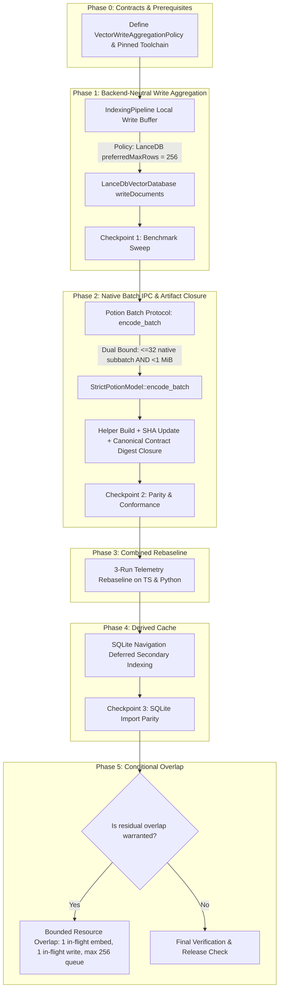

# Satori Offline Indexing Performance Optimization Plan

## Executive Summary

Based on empirical benchmarks across two distinct workloads—**`satori`** (TypeScript-heavy, 13.5k chunks) and **`tradingview_ratio`** (Python-heavy, 19.6k chunks, 33.9k relationships)—this plan executes the high-confidence payload and publication optimizations to accelerate offline indexing without weakening correctness, publication safety, or vector store abstraction boundaries.



---

## Empirical Baselines & Targets

| Workload Class | Original Baseline | Target (Horizon 1) | Key Bottleneck Addressed |
| :--- | :--- | :--- | :--- |
| **Class A: `satori`** (TS-heavy, 577 files, 13.5k chunks) | **52.7s** | **18–22s** (Target) | LanceDB 425 write calls $\to$ ~54 calls; Potion IPC batching |
| **Class B: `tradingview_ratio`** (Python, 1,422 files, 19.6k chunks) | **146.1s** | **45–55s** (Target) | LanceDB 612 write calls $\to$ ~77 calls; Python navigation cache |

> [!NOTE]
> 256 rows is the selected **bounded-memory tradeoff** (512 remains the measured maximum-throughput point: 27 calls on `satori` / 39 calls on `tradingview_ratio`). Wall-clock numbers represent engineering targets; release acceptance is governed by empirical call-count reductions, frozen inference parity, and absence of correctness regressions.

---

## Step-by-Step Implementation Sequence

### Phase 0: Contract Definitions & Prerequisites

#### 1. Backend-Neutral Write Policy Contract
Define a generic, backend-neutral write aggregation contract in `packages/core/src/vectordb/types.ts`:

```ts
export interface VectorWriteAggregationPolicy {
    readonly preferredMaxRows: number;
}
```

Add optional capability to `VectorDatabase`:
```ts
export interface VectorDatabase {
    // ...
    getWriteAggregationPolicy?(): VectorWriteAggregationPolicy;
}
```
Absence of `getWriteAggregationPolicy()` means no Core-side write aggregation is performed (unbuffered write dispatch).

#### 2. Pinned Toolchain Requirement
Native helper compilation must use the pinned Rust toolchain recorded in `inference-contract.canonical.json` (`rustc 1.97.1 (8bab26f4f 2026-07-14)`, `x86_64-unknown-linux-gnu`). Shipping binaries must not be generated from arbitrary local compiler versions.

---

### Phase 1: Backend-Neutral Vector Write Aggregation

#### 1. Architectural Intent
Decouple `EmbeddingBatchPolicy` ($\le 32$ items for Potion) from vector persistence flushing without leaking backend-specific constants into generic pipeline orchestration.

* `LanceDbVectorDatabase` reports `getWriteAggregationPolicy(): { preferredMaxRows: 256 }`.
* `MilvusVectorDatabase` retains its unbuffered / 117-row + 4 MiB policy.
* [`IndexingPipeline`](file:///home/hamza/repo/satori/packages/core/src/core/indexing-pipeline.ts) consumes the resolved policy and buffers embedded [`IndexedVectorDocument`](file:///home/hamza/repo/satori/packages/core/src/vectordb/types.ts)s before dispatching `writeDocuments()`. Adapters without write aggregation preference operate unbuffered.

#### 2. Implementation Specifications
* **Files:**
  * [`packages/core/src/vectordb/types.ts`](file:///home/hamza/repo/satori/packages/core/src/vectordb/types.ts): Declare `VectorWriteAggregationPolicy` interface and `getWriteAggregationPolicy?()`.
  * [`packages/core/src/vectordb/lancedb-vectordb.ts`](file:///home/hamza/repo/satori/packages/core/src/vectordb/lancedb-vectordb.ts): Implement `getWriteAggregationPolicy(): VectorWriteAggregationPolicy { return { preferredMaxRows: 256 }; }`.
  * [`packages/core/src/core/indexing-pipeline.ts`](file:///home/hamza/repo/satori/packages/core/src/core/indexing-pipeline.ts):
    * Separate chunk embedding from buffer flushing:
      ```ts
      private async embedChunkBatch(batch: ChunkBatch): Promise<IndexedVectorDocument[]>;
      private async flushVectorWriteBuffer(collectionName: string, buffer: IndexedVectorDocument[], options: ProcessOptions): Promise<void>;
      ```
    * Maintain write buffer as local operation state: `const pendingVectorWrites: IndexedVectorDocument[] = [];` inside `processFileList()`, avoiding instance field reentrancy hazards.
    * Exact-size flush loop:
      ```ts
      if (writeAggregationPolicy) {
          while (pendingVectorWrites.length >= writeAggregationPolicy.preferredMaxRows) {
              const batch = pendingVectorWrites.splice(0, writeAggregationPolicy.preferredMaxRows);
              await this.flushVectorWriteBuffer(collectionName, batch, options);
          }
      } else {
          const batch = pendingVectorWrites.splice(0, pendingVectorWrites.length);
          await this.flushVectorWriteBuffer(collectionName, batch, options);
      }

      // EOF flush:
      if (pendingVectorWrites.length > 0) {
          const batch = pendingVectorWrites.splice(0, pendingVectorWrites.length);
          await this.flushVectorWriteBuffer(collectionName, batch, options);
      }
      ```
* **Safety Fences & Failure Semantics:**
  * Re-assert `assertMutationCurrent()` and embedding identity immediately prior to each `flushVectorWriteBuffer()` call.
  * On parsing or embedding failure: drop only the unpersisted local `pendingVectorWrites` buffer and propagate the error. Discard of the candidate staged generation remains authoritative in `IndexGenerationWorkflow`.

#### 3. Verification & Checkpoint 1
* Unit tests: `pnpm --filter @zokizuan/satori-core test src/core/indexing-pipeline.test.ts`.
* LanceDB adapter tests: `pnpm --filter @zokizuan/satori-core test src/vectordb/lancedb-vectordb.test.ts`.
* 3-run benchmark sweep on `satori` and `tradingview_ratio`: Confirm write calls drop to $\approx 54$ and $\approx 77$, with write duration $<3.5\text{s}$.

---

### Phase 2: Potion Native Batch IPC Protocol & Artifact Closure

#### 1. Architectural Intent
Replace 32 sequential single-text JSON lines over stdin/stdout with a single batched IPC frame executing `StrictPotionModel::encode_batch(&texts)`.

#### 2. Protocol Specifications
* **Rust Worker Protocol:** [`experiments/potion-l0-l1/src/main.rs`](file:///home/hamza/repo/satori/experiments/potion-l0-l1/src/main.rs)
  ```rust
  #[derive(Debug, Deserialize)]
  #[serde(tag = "op", rename_all = "snake_case")]
  enum WorkerRequest {
      Encode { id: String, role: Role, text: String },
      EncodeBatch { id: String, role: Role, texts: Vec<String> },
      InjectPanic { id: String },
      Shutdown { id: String },
  }

  #[derive(Debug, Serialize)]
  #[serde(rename_all = "camelCase")]
  struct WorkerBatchItem {
      retained_token_count: usize,
      vector: Vec<f32>,
  }

  #[derive(Debug, Serialize)]
  #[serde(rename_all = "camelCase")]
  struct WorkerResponse {
      id: String,
      ok: bool,
      #[serde(skip_serializing_if = "Option::is_none")]
      retained_token_count: Option<usize>,
      #[serde(skip_serializing_if = "Option::is_none")]
      vector: Option<Vec<f32>>,
      #[serde(skip_serializing_if = "Option::is_none")]
      items: Option<Vec<WorkerBatchItem>>,
      #[serde(skip_serializing_if = "Option::is_none")]
      error_code: Option<String>,
  }
  ```
* **TypeScript Client:** [`packages/core/src/embedding/potion-embedding.ts`](file:///home/hamza/repo/satori/packages/core/src/embedding/potion-embedding.ts)
  * Distinguish public `maxBatchItems` (up to 64) from native worker sub-batches ($\le 32$ items AND serialized request frame $< 1\text{ MiB}$).
  * Reject single texts exceeding `MAX_WORKER_FRAME_BYTES` (do not split individual strings).
  * Validate worker response frame byte bounds ($< 1\text{ MiB}$), 1:1 structural alignment, dimension (256), finite floats, and normalization.

#### 3. Artifact & Version Authority Closure
1. Compile `satori-potion` with pinned toolchain (`rustc 1.97.1`).
2. Replace `packages/mcp/assets/potion/linux-x64/satori-potion`.
3. Compute SHA-256 of new binary and update `POTION_HELPER_SHA256` in `potion-embedding.ts`.
4. Update `experiments/potion-l0-l1/fixtures/inference-contract.canonical.json` with new `helperSha256`.
5. Compute canonical contract SHA-256 and update `POTION_INFERENCE_CONTRACT_DIGEST` in `potion-embedding.ts`.
6. Add compatibility test proving that existing index fingerprints created with the prior artifact digest correctly trigger the expected `requires_reindex` status.

#### 4. Verification & Checkpoint 2
* Potion TypeScript tests: `pnpm --filter @zokizuan/satori-core test src/embedding/potion-embedding.test.ts`.
* Native conformance & frozen parity verification:
  * Maximum absolute difference $\le 10^{-6}$
  * Minimum cosine similarity $\ge 0.999999$
  * Retained token counts exactly equal
  * Output ordering exactly equal
* Real batch IPC benchmark on 344 representative chunks: Confirm throughput materially exceeds 856 chunks/sec baseline.

---

### Phase 3: Combined Pipeline Rebaseline

#### 1. Execution
Run 3 controlled benchmark runs on both repositories with **LanceDB 256 Aggregation + Potion Native Batch IPC**:
* `satori` (TypeScript-heavy)
* `tradingview_ratio` (Python-heavy)

#### 2. Full Telemetry Object Comparison
Record full telemetry metrics (Analysis, Embedding, VectorWrites, Navigation, Publication, Total).

#### 3. Critical Path Audit & Phase 5 Evaluation
* Compare residual analysis vs. embedding vs. write durations.
* Authorize Phase 5 **only if** the combined telemetry establishes sufficient serial overlap headroom to justify queue coordination complexity.

---

### Phase 4: SQLite Navigation Deferred Secondary Indexing

#### 1. Implementation Specifications
* **File:** [`packages/core/src/navigation/sqlite.ts`](file:///home/hamza/repo/satori/packages/core/src/navigation/sqlite.ts)
* Refactor `createSchema` into `createTables` and `createSecondaryIndexes`.
* In `importNavigationToSqlite()`:
  1. Open temporary database.
  2. `createTables(database)`.
  3. `BEGIN` transaction $\to$ bulk insert files, symbols, relationships.
  4. `createSecondaryIndexes(database)`.
  5. `COMMIT` transaction $\to$ close $\to$ atomic rename into final path.
* No PRAGMA modifications (preserve existing durability invariants).

#### 2. Verification & Checkpoint 4
* Navigation tests: `pnpm --filter @zokizuan/satori-core test src/navigation/sqlite.test.ts`.
* Parity test: Verify navigation query responses (`findSymbols`, `findCallers`, `findImplementations`) match baseline output.

---

### Phase 5: Conditional Bounded Pipeline Overlap

*(Executed only if Phase 3 rebaseline authorizes it)*

#### 1. Resource & Queue Bounds
* Maximum 1 embedding microbatch in flight.
* Maximum 1 vector write aggregation batch in flight.
* Maximum 256 completed-but-unpersisted vectors in write queue.
* Maximum 1 next embedding microbatch staged.
* Zero unbounded source or chunk queues.
* Deterministic output order preserved.

#### 2. Safe Failure & Cancellation Contract
* On first error:
  1. Immediately stop scheduling new analysis, embedding, or write tasks.
  2. Stop accepting additional entries into the queue.
  3. Drain/settle any active in-flight LanceDB write mutation to avoid racing cleanup.
  4. Propagate the original failure to `IndexGenerationWorkflow`.
  5. `IndexGenerationWorkflow` authoritative handler discards the candidate vector generation and unsealed sidecars.

---

## Safety Invariants & Acceptance Gates

> [!IMPORTANT]
> Every change must strictly satisfy the following invariants:

1. **Semantic Content Equivalence:** For unchanged source and policy inputs, completed runs must preserve the same indexed source-file identities/hashes, chunk identities and searchable projections, extracted symbol definitions, and relationship graph. Runtime-generated metadata such as `indexedAt`, generation IDs, and timestamps is excluded from byte-level equivalence.
2. **Canonical Contract Validity:** Authoritative completion markers must strictly conform to `CanonicalCompletionMarker` schema, contain valid fingerprints, and bind to sealed navigation generations (accounting for dynamic `runId`, `completedAt` timestamps, and updated artifact digests).
3. **Atomic Staged Publication:** Incomplete or interrupted indexing runs must never leak orphan vector chunks, unsealed sidecars, or corrupt LanceDB tables into live search paths.
4. **No Abstraction Leakage:** `VectorDatabase` interface remains backend-agnostic. Backend-specific write batching policies are declared by adapters and consumed through generic capabilities.
5. **Comprehensive Test Suite & Release Checks:**
   * Unit & integration tests in `packages/core` and `packages/mcp`.
   * Potion inference contract & artifact verification tests.
   * `pnpm run check`
   * `pnpm run release:check`
