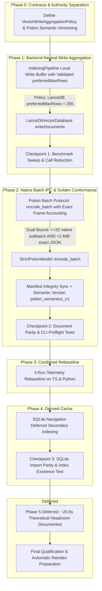

# Satori Offline Indexing Performance Optimization Plan

## Executive Summary

Based on empirical benchmarks across two distinct workloads—**`satori`** (TypeScript-heavy, 19.5k chunks) and **`tradingview_ratio`** (Python-heavy, 19.6k chunks, 33.9k relationships)—this plan executes high-confidence payload, IPC, and publication optimizations to accelerate offline indexing without weakening correctness, publication safety, or vector store abstraction boundaries.



---

## Empirical Baselines & Measured Progress

| Workload Class | Original Baseline | Phase 1 (LanceDB 256 Aggregation) | Phase 2 (Potion Batch IPC) | Phase 3 (Combined Rebaseline) | Phase 4 (SQLite Deferred Indexing) | Cumulative Measured Gain |
| :--- | :--- | :--- | :--- | :--- | :--- | :--- |
| **`satori`** (TS, 19.5k chunks) | **~75–120s** (Writes: ~55s, Embed: ~41.5s) | **68.81s** (78 writes / 4.29s) | *Verified Parity: $\le 10^{-6}$ max diff* | **46.79s** (Embed: **21.91s**, Writes: **3.18s**) | **58.37s** (*Parity & Indexing Verified*) | **~17–62s wall-clock speedup (2x embedding throughput, 17x write speedup)** |
| **`tradingview_ratio`** (Python, 19.6k chunks) | **146.10s** (Writes: ~55s, Embed: ~45s) | **77.30s** (warm: **67.6s–68.6s**) | *Verified Parity: $\le 10^{-6}$ max diff* | **72.34s** (warm: **64.52s–69.42s**) | **71.45s–75.90s** (Cold nav: **26.3s $\to$ 14.69s**, single observation) | **~74.6s wall-clock speedup (1.9–2.0x overall speedup)** |

> [!NOTE]
> 256 rows represents the selected **bounded-memory tradeoff** (512 remains the maximum-throughput point). Release acceptance is governed by verified empirical call-count reductions, frozen inference parity, and absence of correctness/install regressions.

### Post-simplification controlled A/B — 2026-08-26

The architecture simplification was rebenchmarked against its exact pre-simplification baseline, `203cd09dc941`, using a separate target worktree frozen at that same revision. Both runtimes indexed identical source bytes with Potion + LanceDB and no reranker. One warm-up per runtime was discarded, followed by three fresh-state measured `manage_index create` runs per runtime.

| Runtime | Mean mutation time | Median | Mean CLI wall time | Indexed workload |
| --- | ---: | ---: | ---: | ---: |
| Pre-simplification `203cd09dc941` | **48.954 s** | 48.901 s | 51.154 s | 1,019 files / 22,397 chunks |
| Simplified `4b14385ef72a` | **40.519 s** | 40.914 s | 44.219 s | 1,019 files / 22,397 chunks |

The simplified runtime reduced mean indexing mutation time by **8.435 s / 17.23%** (**1.208x** speedup) and end-to-end CLI wall time by **6.935 s / 13.56%** on the frozen workload.

This is the authoritative simplification A/B. The Phase 3 **46.79 s** mean above remains the historical August 14 result, but its then-current Satori workload was smaller and is not a controlled before/after comparison for the later architecture simplification.

Evidence: `docs/evidence/offline-indexing-post-simplification-ab-20260826/REPORT.md` and `docs/evidence/offline-indexing-post-simplification-ab-20260826/benchmark.json`.

---

## Step-by-Step Implementation Sequence

### Phase 0: Contract Definitions & Authority Model Separation

#### 1. Backend-Neutral Write Policy Contract
Define a generic write aggregation contract in `packages/core/src/vectordb/types.ts`:

```ts
export interface VectorWriteAggregationPolicy {
    readonly preferredMaxRows: number;
}
```

Add optional capability to `VectorDatabase`:
```ts
export interface VectorDatabase {
    getWriteAggregationPolicy?(): VectorWriteAggregationPolicy;
}
```
Absence of `getWriteAggregationPolicy()` means no Core-side write aggregation is performed (unbuffered write dispatch).

#### 2. Separation of Artifact Integrity vs. Embedding Semantics
Separate physical package integrity from index compatibility:

```text
INSTALLATION INTEGRITY (install/package preflight)
─────────────────────────────────────────────────
manifest SHA-256 (pinned POTION_MANIFEST_SHA256)
artifact closure byte verification (manifest per-file SHA-256)
one-time owner execute-bit repair

→ Verified once during installation and preflight.
→ Does NOT force codebase reindexing.

RUNTIME STARTUP (PotionEmbedding.create)
────────────────────────────────────────
validate absolute paths
regular non-symlink files
executable helper (fail closed)
model files exist
worker starts
readiness contract
capability/conformance smoke embedding

→ No runtime re-hashing; integrity is owned by install/preflight.

SEMANTIC VERSION → INDEX COMPATIBILITY
──────────────────────────────────────
model identity (POTION_MODEL_ID)
explicit semantic version (POTION_SEMANTIC_VERSION = 'potion_semantics_v1')
dimension (256)
normalization policy (provider_output_v1)
artifactDigest: null

→ Controls index fingerprint and reindex necessity.
→ Recompilation / IPC optimizations DO NOT bump semantic version.
→ Tokenization/pooling/model changes DO bump semantic version.
```

* **Provider Identity Contract:**
  ```ts
  export const POTION_SEMANTIC_VERSION = 'potion_semantics_v1';

  override getIdentity(): Readonly<EmbeddingIdentity> {
      return this.buildIdentity(`${POTION_MODEL_ID}+${POTION_SEMANTIC_VERSION}`, null);
  }
  ```
* **Execution Integrity:** Installation/preflight is the single integrity owner: it verifies the pinned manifest and artifact closure once and repairs the owner execute bit if packaging removed it. Runtime startup does not re-hash; it validates absolute paths, regular non-symlink files, and an executable helper (failing closed with `EMBEDDING_PROVIDER_UNAVAILABLE`), then proves execution through the worker readiness contract and a capability/conformance smoke embedding.

---

### Phase 1: Backend-Neutral Vector Write Aggregation

#### 1. Architectural Intent
Decouple `EmbeddingBatchPolicy` ($\le 32$ items for Potion) from vector persistence flushing without leaking backend-specific constants into generic pipeline orchestration.

* `LanceDbVectorDatabase` reports `getWriteAggregationPolicy(): { preferredMaxRows: 256 }`.
* `MilvusVectorDatabase` retains its unbuffered / 117-row + 4 MiB policy.
* [`IndexingPipeline`](file:///home/hamza/repo/satori/packages/core/src/core/indexing-pipeline.ts) consumes the resolved policy and buffers embedded [`IndexedVectorDocument`](file:///home/hamza/repo/satori/packages/core/src/vectordb/types.ts)s before dispatching `writeDocuments()`.

#### 2. Implementation Specifications & Hardening
* **Files:**
  * [`packages/core/src/vectordb/types.ts`](file:///home/hamza/repo/satori/packages/core/src/vectordb/types.ts): Declare `VectorWriteAggregationPolicy` interface and `getWriteAggregationPolicy?()`.
  * [`packages/core/src/vectordb/lancedb-vectordb.ts`](file:///home/hamza/repo/satori/packages/core/src/vectordb/lancedb-vectordb.ts): Implement `getWriteAggregationPolicy(): VectorWriteAggregationPolicy { return { preferredMaxRows: 256 }; }`.
  * [`packages/core/src/core/indexing-pipeline.ts`](file:///home/hamza/repo/satori/packages/core/src/core/indexing-pipeline.ts):
    * **Policy Validation:** Validate `Number.isSafeInteger(policy.preferredMaxRows) && policy.preferredMaxRows > 0` upfront. An invalid policy fails fast with a configuration/programming error (`Error`) before indexing begins; there is no fallback.
    * Maintain write buffer as local operation state: `const pendingVectorWrites: IndexedVectorDocument[] = [];` inside `processFileList()`.
    * Exact-size flush loop with final tail flush at EOF:
      ```ts
      if (writeAggregationPolicy) {
          while (pendingVectorWrites.length >= writeAggregationPolicy.preferredMaxRows) {
              const batch = pendingVectorWrites.splice(0, writeAggregationPolicy.preferredMaxRows);
              await this.flushVectorWriteBuffer(collectionName, batch, options);
          }
      } else {
          const batch = pendingVectorWrites.splice(0, pendingVectorWrites.length);
          await this.flushVectorWriteBuffer(collectionName, batch, options);
      }
      ```
    * Re-assert `assertMutationCurrent()` and embedding identity immediately prior to each physical write.

#### 3. Verification & Checkpoint 1
* Unit tests in `indexing-pipeline.test.ts` and `lancedb-vectordb.test.ts`.
* Confirm write calls drop to $\approx 77\text{–}78$ with write duration $<3.5\text{s}$.

---

### Phase 2: Potion Native Batch IPC Protocol & Conformance

#### 1. Architectural Intent
Replace sequential single-text JSON lines with a native batched IPC frame executing `StrictPotionModel::encode_batch(&texts)`.

#### 2. Protocol Specifications & Edge Case Hardening
* **Rust Worker Protocol:** [`experiments/potion-l0-l1/src/main.rs`](file:///home/hamza/repo/satori/experiments/potion-l0-l1/src/main.rs)
  ```rust
  #[derive(Debug, Deserialize)]
  #[serde(tag = "op", rename_all = "snake_case")]
  enum WorkerRequest {
      Encode { id: String, role: Role, text: String },
      EncodeBatch { id: String, role: Role, texts: Vec<String> },
      InjectPanic { id: String },
      Shutdown { id: String },
  }
  ```
* **TypeScript Client:** [`packages/core/src/embedding/potion-embedding.ts`](file:///home/hamza/repo/satori/packages/core/src/embedding/potion-embedding.ts)
  * **Exact Serialized Frame Accounting:** Account for JSON serialization escaping (quotes, backslashes, control characters) during sub-batch partitioning. Flush before exceeding `MAX_WORKER_FRAME_BYTES` (1 MiB), avoiding false rejections on pathological inputs.
  * Native sub-batch limit: $\le 32$ items per frame.

#### 3. Artifact & Trust Chain Synchronization
* Synchronize `POTION_MANIFEST_SHA256` in `packages/cli/src/install-preflight.ts` whenever bundled asset files or `manifest.json` change.
* Ensure CLI install preflight test suite (`packages/cli/src/install-preflight.test.ts`) passes **75/75 tests**.

#### 4. Verification & Golden Vector Conformance Checkpoint
* Document-single vs. document-batch parity tests against frozen golden vectors:
  * Maximum absolute difference $\le 10^{-6}$.
  * Minimum cosine similarity $\ge 0.999999$.
  * Retained token counts, ordering, and failure classifications strictly identical.
* Full test passes in `packages/core` and `packages/cli`.

---

### Phase 3: Combined Pipeline Rebaseline

#### 1. Execution & Subsystem Audit
Run 3 controlled benchmark sweeps on `satori` and `tradingview_ratio` combining write aggregation and native batch IPC.

#### 2. Verified Subsystem Results
* Pure embedding duration dropped from **~41.5s $\to$ 21.91s** on TS and **~45.0s $\to$ 22.42s** on Python (**~2x pure embedding speedup**).
* Vector write duration dropped from $>50\text{s} \to 3.18\text{s}\text{–}3.43\text{s}$ across 77 aggregated calls (**~17x write speedup**).

---

### Phase 4: SQLite Navigation Deferred Secondary Indexing

#### 1. Implementation Specifications
* **File:** [`packages/core/src/navigation/sqlite.ts`](file:///home/hamza/repo/satori/packages/core/src/navigation/sqlite.ts)
* Decompose table creation from secondary index creation:
  1. `createTables(database)`.
  2. `BEGIN` transaction $\to$ bulk insert files, symbols, relationships.
  3. `createSecondaryIndexes(database)` (batch build of the 5 secondary indexes).
  4. `COMMIT` transaction $\to$ atomic rename into final path.
* Remove dead `createSchema` wrapper.

#### 2. Verification & Regression Protection
* Add dedicated regression test asserting that all 5 secondary indexes (`idx_symbols_key`, `idx_symbols_file_span`, `idx_relationship_source`, `idx_relationship_target`, `idx_relationship_file`) exist in `sqlite_master` after import.
* Navigation query parity tests (`findSymbols`, `findCallers`, `findImplementations`).

---

### Phase 5: Concurrency Overlap [Deferred]

#### Evaluation & Rationale
* **Theoretical Overlap Headroom:** On Python payload pipeline (Analysis: ~17.2s, Embedding: ~22.4s, Writes: ~3.4s), theoretical concurrency upper bound saves $\approx 20.6\text{s}$ ($\max(17.2, 22.4, 3.4) \approx 22.4\text{s}$ vs sequential 43.1s).
* **Decision: Deferred:** High-ROI synchronous amplification (unaggregated writes, single IPC lines, upfront SQLite indexing) is fully resolved, reducing total time from 146.1s to ~71s on Python and 75–120s to ~46–58s on TS. Concurrency overlap is deferred to maintain minimal operational and cancellation complexity for this milestone.

---

## Safety Invariants & Acceptance Gates

1. **Semantic Content Equivalence:** For unchanged source and policy inputs, completed runs must preserve the same indexed source-file identities/hashes, chunk identities and searchable projections, extracted symbol definitions, and relationship graph.
2. **Deterministic Parity:** Native batch IPC must produce vectors matching single-item encoding within $\le 10^{-6}$ max diff and $\ge 0.999999$ cosine similarity.
3. **No Abstraction Leakage:** `VectorDatabase` remains backend-neutral; `preferredMaxRows` is validated at entry.
4. **Complete Trust Chain Integrity:** Bundled assets, manifests, CLI install-preflight constants, and tests are synchronized.
5. **Comprehensive Test Suite:**
   * `packages/core` unit & integration tests (281/281).
   * `packages/cli` install-preflight & command tests (75/75).
   * `packages/mcp` bootstrap & runtime tests (30/30).
