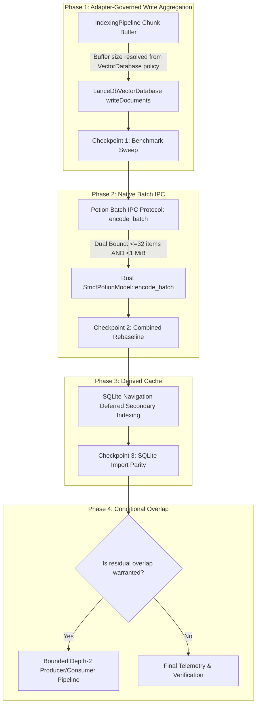

# Satori Offline Indexing Performance Optimization Plan

## Executive Summary

Based on empirical benchmarks across two distinct workloads—**`satori`** (TypeScript-heavy, 13.5k chunks) and **`tradingview_ratio`** (Python-heavy, 19.6k chunks, 33.9k relationships)—this plan executes the high-confidence payload and publication optimizations to accelerate offline indexing without weakening correctness, publication safety, or vector store abstraction boundaries.



---

## Empirical Baselines & Targets

| Workload Class | Original Baseline | Target (Horizon 1) | Key Bottleneck Addressed |
| :--- | :--- | :--- | :--- |
| **Class A: `satori`** (TS-heavy, 577 files, 13.5k chunks) | **52.7s** | **18–22s** (Sub-25s SLA) | LanceDB 425 write calls $\to$ ~27–54 calls; Potion IPC batching |
| **Class B: `tradingview_ratio`** (Python, 1,422 files, 19.6k chunks) | **146.1s** | **45–55s** (>2.6× Speedup) | LanceDB 612 write calls $\to$ ~39–77 calls; Python navigation cache |

---

## Step-by-Step Implementation Sequence

### Phase 1: Adapter-Governed Vector Write Aggregation

#### 1. Architectural Intent
Decouple `EmbeddingBatchPolicy` ($\le 32$ items for Potion) from vector persistence flushing without leaking backend-specific constants into generic pipeline orchestration.

* The vector database adapter (e.g. `LanceDbVectorDatabase`) declares its preferred write aggregation policy (target: **256 rows**) via its backend capabilities (`getBackendInfo()` or `writeBatchPolicy`).
* [`IndexingPipeline`](file:///home/hamza/repo/satori/packages/core/src/core/indexing-pipeline.ts) consumes this resolved policy and buffers embedded [`IndexedVectorDocument`](file:///home/hamza/repo/satori/packages/core/src/vectordb/types.ts)s before dispatching `writeDocuments()`. Adapters without write aggregation preference operate unbuffered (`batchSize = 1` or immediate flush).

```text
[Chunk Generator] ──(32 chunks)──> [Potion Embedding] ──(32 vectors)──┐
                                                                       ▼
                                                       [Pipeline Write Buffer]
                                                       (Flushes at backend policy size or EOF)
                                                                       │
                                                                       ▼
                                                       [VectorDatabase writeDocuments()]
```

#### 2. Implementation Specifications
* **Files:**
  * [`packages/core/src/vectordb/types.ts`](file:///home/hamza/repo/satori/packages/core/src/vectordb/types.ts): Expose optional `writeBatchSize` in `VectorStoreBackendInfo` / `VectorDatabase`.
  * [`packages/core/src/vectordb/lancedb-vectordb.ts`](file:///home/hamza/repo/satori/packages/core/src/vectordb/lancedb-vectordb.ts): Declare `writeBatchSize = 256` in `getBackendInfo()`.
  * [`packages/core/src/core/indexing-pipeline.ts`](file:///home/hamza/repo/satori/packages/core/src/core/indexing-pipeline.ts): Accumulate completed vector records in `this.pendingWriteBuffer` up to the resolved write batch limit or EOF.
* **Safety Fences:**
  * Re-assert `assertMutationCurrent()` immediately prior to each aggregated `writeDocuments()` call.
  * Re-verify embedding identity validity prior to write dispatch.
  * In case of any error during parsing or embedding, immediately clear the write buffer and fail fast without publishing staged state.

#### 3. Verification & Checkpoint 1
* Run unit tests: `pnpm --filter @zokizuan/satori-core test src/core/indexing-pipeline.test.ts`.
* Run benchmark harness on `satori` and `tradingview_ratio`. Confirm LanceDB write call counts drop from **425 $\to$ ~54** (`satori`) and **612 $\to$ ~77** (`tradingview_ratio`), with write duration dropping to $<3.5\text{s}$.

---

### Phase 2: Potion Native Batch IPC Protocol (`encode_batch`)

#### 1. Architectural Intent
Replace 32 sequential single-text JSON lines over stdin/stdout with a single batched IPC frame executing `StrictPotionModel::encode_batch(&texts)`.

#### 2. Implementation Specifications
* **Rust Worker Protocol:** [`experiments/potion-l0-l1/src/main.rs`](file:///home/hamza/repo/satori/experiments/potion-l0-l1/src/main.rs)
  * Add `WorkerRequest::EncodeBatch { id: String, role: Role, texts: Vec<String> }`.
  * Add `WorkerResponse::Batch { id: String, ok: bool, vectors: Option<Vec<Vec<f32>>>, retained_token_counts: Option<Vec<usize>>, error_code: Option<String> }`.
  * Invoke `model.encode_batch(&texts)` within panic containment hooks.
* **TypeScript Client:** [`packages/core/src/embedding/potion-embedding.ts`](file:///home/hamza/repo/satori/packages/core/src/embedding/potion-embedding.ts)
  * Update `embedDocuments(texts)`:
    * Accumulate texts up to `maxBatchItems` (32) **AND** total frame bytes $< 1\text{ MiB}$ (`MAX_WORKER_FRAME_BYTES`).
    * Transmit single frame: `{ op: "encode_batch", id, role: "document", texts }`.
    * Fall back to frame splitting if a single batch exceeds the 1 MiB boundary.
    * Parse response and validate dimensions (256), finite floats, and 1:1 order alignment.

#### 3. Verification & Checkpoint 2
* Run Potion unit tests: `pnpm --filter @zokizuan/satori-core test src/embedding/potion-embedding.test.ts`.
* Verify vector parity: Ensure cosine similarity between single-frame embeddings and batched embeddings is $1.00000 \pm 10^{-6}$.
* Measure real throughput: Confirm `chunksPerSec` increases significantly over the 856 chunks/sec baseline.

---

### Phase 3: Combined Pipeline Rebaseline

#### 1. Execution
Run full end-to-end indexing on both repositories with **LanceDB 256 Aggregation + Potion Batch IPC** active:
* `satori` (TypeScript-heavy)
* `tradingview_ratio` (Python-heavy)

#### 2. Telemetry Comparison Table
Capture and record the full telemetry breakdown:
```text
┌─────────────────────────────────┬──────────────────┬──────────────────┐
│ Phase / Telemetry Metric        │ satori           │ tradingview      │
├─────────────────────────────────┼──────────────────┼──────────────────┤
│ totalMs (Wall Clock)            │ [To measure]     │ [To measure]     │
│ payloadPipeline.analysis        │ [To measure]     │ [To measure]     │
│ payloadPipeline.embedding       │ [To measure]     │ [To measure]     │
│ payloadPipeline.vectorWrites    │ [To measure]     │ [To measure]     │
│ navigation                      │ [To measure]     │ [To measure]     │
│ publication                     │ [To measure]     │ [To measure]     │
└─────────────────────────────────┴──────────────────┴──────────────────┘
```

#### 3. Decision Point for Phase 5 (Pipelining)
Analyze the new critical path:
* If AST analysis dominates (e.g., 16s vs. 6s embedding and 2s writes), evaluate whether a bounded depth-2 overlap pipeline provides sufficient wall-clock reduction to justify its coordination logic.

---

### Phase 4: SQLite Navigation Deferred Secondary Indexing

#### 1. Implementation Specifications
* **File:** [`packages/core/src/navigation/sqlite.ts`](file:///home/hamza/repo/satori/packages/core/src/navigation/sqlite.ts)
* In `createSchema(database)`: Create only the tables and primary keys (`navigation_manifest`, `files`, `symbols`, `relationships`).
* In `importNavigationToSqlite()`:
  1. Open temporary database.
  2. Create tables (`createSchema`).
  3. `BEGIN` transaction $\to$ bulk insert all files, symbols, and relationships.
  4. Issue `CREATE INDEX` for secondary indexes (`idx_symbols_key`, `idx_symbols_file_span`, `idx_relationship_source`, `idx_relationship_target`, `idx_relationship_file`).
  5. `COMMIT` transaction $\to$ close $\to$ atomic rename into final destination.

#### 2. Verification & Checkpoint 4
* Run navigation test suite: `pnpm --filter @zokizuan/satori-core test src/navigation/sqlite.test.ts`.
* Verify query performance and data integrity: Execute sample symbol lookups and relationship traversals on `tradingview_ratio`'s imported navigation cache.

---

### Phase 5: Conditional Bounded Pipeline Overlap

*(Executed only if Phase 3 rebaseline establishes significant residual headroom)*

#### 1. Specifications
* Overlap embedding of batch $N$ with vector write dispatch of batch $N-1$ and AST analysis of batch $N+1$.
* Enforce maximum queue depth of 2 batches with strict backpressure.
* Maintain deterministic error handling: any failure immediately aborts in-flight promises and cleans up staged collections.

---

## Safety Invariants & Acceptance Gates

> [!IMPORTANT]
> Every change must strictly satisfy the following invariants:

1. **Semantic Content Equivalence:** Completed indexing runs must produce identical indexed file sets, content hashes, extracted symbol definitions, and relationship graphs across runs.
2. **Canonical Contract Validity:** Authoritative completion markers must strictly conform to `CanonicalCompletionMarker` schema, contain valid fingerprints, and bind to sealed navigation generations.
3. **Atomic Staged Publication:** Incomplete or interrupted indexing runs must never leak orphan vector chunks, unsealed sidecars, or corrupt LanceDB tables into live search paths.
4. **No Abstraction Leakage:** `VectorDatabase` interface remains backend-agnostic. Backend-specific write batching policies are declared by adapters and consumed through generic options/capabilities.
5. **Zero Test Regressions:** All unit, integration, and e2e test suites in `packages/core` and `packages/mcp` must pass cleanly.
