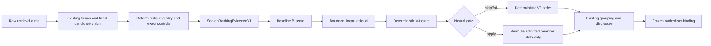
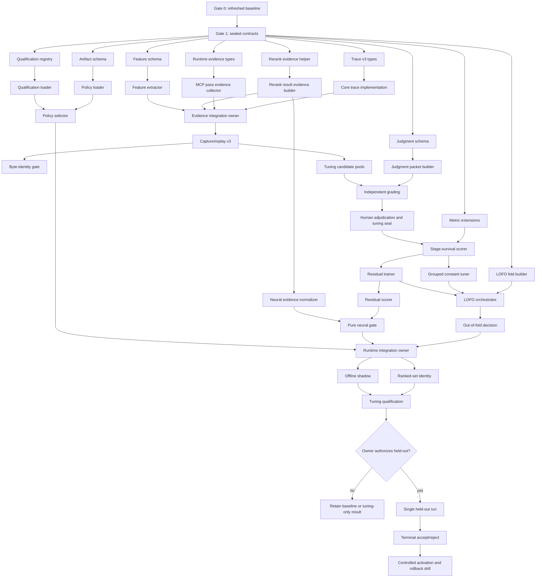

# Satori Ranking Policy V3 — Reviewed Small-Agent Design

> Status: design proposal after end-to-end review. This document does not authorize implementation or held-out opening.
>
> Review basis: the uploaded `SATORI_RANKING_POLICY_V3_PLAN.md`, its named base revision `633c1d4a334655163844af6c3f6905d0ca5df793`, the repository interfaces at that revision, and the reported completion of the separate security/search-hardening branch. The first execution task must refresh every source claim against the actual integration HEAD because that branch is not available in the remote repository reviewed here.

## 1. Executive decision

Keep the original plan's goals, evidence discipline, deterministic safety contracts, and held-out rules. Replace its implementation structure.

The original plan is directionally strong but not safe to hand directly to small agents because it:

1. assigns six tasks to `packages/mcp/src/core/search-execution.ts`, creating a central merge bottleneck;
2. proposes a second arm-evidence and metrics system despite existing candidate-trace and search-quality authorities;
3. mixes recall-changing work with ranking work;
4. asks a linear model to reproduce a multiplicative baseline without defining interaction features;
5. treats human relevance judgments as an ordinary implementation task;
6. says held-out remains closed while also requiring new held-out grading;
7. trains and selects on the same tuning population without repository-family cross-validation;
8. leaves model loss, regularization, normalization, calibration, thresholds, and artifact storage ambiguous;
9. introduces shadow use before its configuration surface and simultaneously claims byte-identical public output while adding diagnostics;
10. places a quality receipt hash inside the model artifact, creating an unclear or circular qualification chain.

The recommended first release is **V3.0 Residual Ranking**, not a complete replacement of the current formula:

```text
fixed retrieval and candidate union
→ deterministic eligibility and exact controls
→ versioned pre-policy evidence
→ current baseline B score
→ bounded constrained linear residual
→ optional bounded neural reordering inside the already admitted reranker slots
→ existing grouping, disclosure, and frozen pagination
```

The scoring seam is:

```text
deterministicV3Score = baselineBScore
    + clamp(dot(weights, normalizedFeatures), -maxResidual, +maxResidual)
```

A zero-weight artifact reproduces baseline B exactly. This gives a real identity policy, makes rollback trivial, limits blast radius, and preserves the existing baseline as the fail-closed path.

**Defer to V3.1:** learned candidate depth, core/MCP fusion weights, reranker admission depth, and any setting that can change candidate membership. Those are recall-policy experiments, not pure ranking experiments.

---

## 2. Review findings by original phase

### Phase 0 — retain, but rebase it

The named base is no longer the correct implementation base after the completed hardening branch. Freeze from the actual integration HEAD and include:

- exact commit and tree;
- ancestry from the hardening integration commit;
- baseline policy ID and ranked-set binding ID;
- current search constants;
- exact focused test commands;
- tuning capture digests;
- end-to-end output digests;
- warm latency and RSS;
- proof that held-out was not opened.

Do not use `pnpm --filter <package> test -- <name>` as a focused command. The package test scripts expand broad globs before the extra argument. Use direct `node --import tsx --test <exact-test-file>` invocations, including the MCP test-state-root import where required.

### Phase 1 — use one evidence authority

The repository already has candidate-survival traces for raw dense, raw lexical, fallback lexical, core fusion/result, MCP stages, removals, grouping, and disclosure. Extend that trace to version 3; do not add a parallel optional `retainArmEvidence` output solely for evaluation.

A compact in-memory evidence object is still useful for runtime scoring, but it must be derived from the same normalized stage evidence used by capture/replay.

Feature extraction must happen **before** V3 scoring. It must not be computed “after final scoring.” Baseline B's score may be included as a feature and anchor.

Do not expose full feature vectors in the normal public response during the byte-identity phase. Capture them through an internal bounded evaluation hook. Adding a debug field changes the response contract and defeats a literal byte-identical-response claim.

Replace the ambiguous `candidateDepth = limitRank + passCount` field with explicit stage fields:

```text
rawDenseRank?
rawLexicalRank?
rawFallbackLexicalRank?
coreFusionRank?
mcpUnionRank?
postEligibilityRank?
rerankerAdmissionRank?
```

### Phase 2 — separate tooling, judgments, and held-out

Keep graded 0–3 relevance, but apply it only to tuning authority before held-out authorization.

Do not re-grade existing held-out tasks while claiming the held-out split is closed. Options are:

1. preserve the existing held-out owner/hard-negative authority for the single final adjudication; or
2. create a fresh future graded held-out set under a separate owner-authorized protocol.

V3.0 uses option 1.

A small model may prepare candidate pools and evidence packets. It may not unilaterally create authoritative labels. Every grade requires two independent proposals and one human/adjudicator resolution.

Unjudged candidates are not grade 0. Use:

```ts
type CandidateJudgment = {
    candidateId: string;
    grade: 0 | 1 | 2 | 3;
    status: "judged";
    rationale: string;
    evidence: SourceBoundEvidence;
};
```

Candidates absent from this map are `unjudged` and excluded from graded pair generation.

Measure stage survival rather than one overloaded “union recall” boolean:

```text
knownRelevantInRawArms
knownRelevantAfterCoreFusion
knownRelevantInMcpUnion
knownRelevantAfterEligibility
```

Report two quality tracks:

- **end-to-end:** a missing relevant candidate contributes zero;
- **conditional ranking:** graded rank quality only when a known grade >= 2 candidate survives eligibility.

Do not exclude misses from the only decision metric.

Extend the existing search-quality evaluator/metric authority. Do not create a second independent metric implementation.

### Phase 3 — shrink the tuned-formula baseline

Do not run Bayesian search over more than 50 loosely constrained constants. The tuning data is too small and the search is under-specified.

Use a preregistered **grouped eight-knob contender**:

1. runtime-source path group;
2. tests group;
3. docs group;
4. generated/fixture group;
5. implementation-intent interaction;
6. test-intent interaction;
7. changed-file contribution;
8. owner-evidence contribution.

Keep RRF constants, candidate depth, and reranker admission fixed in V3.0. Use deterministic seeded coordinate search over a sealed finite grid. This contender answers whether simple grouped retuning is enough without pretending to solve the full learned-ranking problem.

### Phase 4 — use a residual linear model

The current score is multiplicative. A linear model over raw fusion, lexical, and multiplier values cannot generally reproduce it. Therefore the original “identity learned policy reproduces baseline” test is invalid unless the feature space contains every required interaction.

Use baseline B as a fixed anchor and learn only a bounded residual. Deterministic controls remain outside the model:

- `must:` and exclusion filtering;
- exact pinning and exact comparator precedence;
- source freshness and publication authority;
- scope eligibility;
- candidate and byte ceilings;
- failure fallback;
- grouping/disclosure/pagination.

The trainer is exactly specified for V3.0:

```text
objective: within-query pairwise logistic loss
pair order: grade 3 > 2 > 1 > 0
regularization: L2
optimizer: projected cyclic coordinate descent
randomness: none after deterministic pair sampling seed
normalization: train-fold statistics only, clipped to artifact bounds
pair cap: deterministic per-query cap to prevent grade-0 domination
output rounding: canonical decimal precision before serialization
```

The exact numeric regularization, coefficient ranges, residual bound, pair cap, iteration count, and convergence rule must be sealed in the preregistration receipt before any tuning output is opened.

### Phase 5 — call it neural evidence, not probability calibration

Raw provider scores are currently available in the reranker contract but discarded by search execution. Retain them.

Do not claim calibrated probability in V3.0. First measure whether scores are comparable across queries. Use provider/model/profile/projection-specific **within-query evidence**:

```text
rank percentile
raw-score percentile
candidate-to-top margin
top-to-second margin
score present / missing
```

Provider identity is a gating key, not a numeric feature. Do not hash provider/model identity into a linear feature.

Current shipped providers return a relevance score. An order-only provider abstraction is not required for V3.0; add it only when a real provider needs it.

Neural evidence may only permute the positions already occupied by the admitted reranker candidate IDs. It may not promote an unadmitted candidate, restore a filtered candidate, or reorder continuation pages independently.

### Phase 6 — compare counterfactual residuals, not absolute baseline bias

Baseline B intentionally contains path multipliers. A neutral path swap can therefore change baseline score. The original requirement that baseline B show no path-only shift is contradictory.

Counterfactual checks should measure:

```text
V3 residual shift
V3 minus baseline rank transition
protected-control outcome
```

The gate is that V3 introduces no unexplained additional shortcut beyond preregistered bounds, not that baseline B is metadata-neutral.

### Phase 7 — offline shadow first

Do not add persistent production shadow logging in the first implementation. It adds privacy, disk-I/O, retention, and concurrency work unrelated to proving ranking quality.

Use:

- offline replay shadow for all tuning captures;
- an optional bounded in-memory/test sink for integration tests;
- no source text or full query persistence;
- no public `shadowApplied` field during the byte-identity phase.

A public diagnostics projection can be added later under its own receipted contract.

### Phase 8 — use leave-one-family-out selection

The original plan trains and selects on one tuning population. Add leave-one-repository-family-out cross-validation.

For N tuning families:

1. train on N-1 families;
2. score the excluded family;
3. repeat for every family;
4. aggregate repository-macro deltas;
5. select hyperparameters only from out-of-fold results;
6. seal the selected training contract;
7. refit once on all tuning families.

Compare these distinct contenders:

1. baseline B;
2. grouped tuned baseline;
3. residual linear deterministic V3;
4. residual linear V3 plus neural evidence;
5. neural-only order as diagnostic only.

Do not list baseline B twice.

### Phase 9 — one authorized opening, no “resealing” claim

The current held-out task details are procedurally protected, not cryptographically unreadable. Existing builder source includes held-out task definitions. The validity rule is therefore no tuning against held-out outcomes, enforced by opening records and task-agent access controls.

At the gate:

- require fresh owner authorization;
- use only the already sealed held-out labels;
- open once;
- make no model, threshold, query, or task changes afterward;
- produce an accept/reject terminal receipt;
- archive the result and close further use.

Do not say the evidence becomes unseen again after opening.

### Phase 10 — move selector and trust decisions earlier

The runtime selector and artifact trust chain are prerequisites for shadow/runtime integration, not the last phase.

Artifact storage decision for V3.0:

```text
bundled baseline B
+ bundled qualified V3 artifact when one exists
+ optional administrator-controlled absolute override outside any indexed repository
```

Do not load a policy from a repository root. Repository-controlled policy files conflict with the local-agent threat model and make prompt-injected repositories part of the ranking trust chain.

Do not put `qualityReceiptSha256` inside the training artifact. Use two objects:

1. immutable model artifact;
2. qualification registry that binds exact artifact SHA-256 to the quality receipt and service class.

Runtime activates learned mode only when the registry qualifies the exact computed artifact hash.

The ranked-set identity should use a composite policy identity:

```text
search_ranking_policy_v3:<artifact-sha256>
```

Because the calibration/evidence policy is inside that artifact, separate artifact and calibration binding fields are redundant.

Ranking policy does not affect index construction, so do not add it to index publication receipts. Record it in runtime startup diagnostics, search diagnostics, and ranked-set bindings.

---

## 3. Corrected architecture

### 3.1 Runtime data flow



### 3.2 Evidence contract

```ts
export type SearchRankingEvidenceV1 = Readonly<{
    schemaVersion: "search_ranking_evidence_v1";
    candidateId: string;
    baselineScore: number;
    retrieval: Readonly<{
        rawDense?: Readonly<{ rank: number; score: number }>;
        rawLexical?: Readonly<{ rank: number; score: number }>;
        rawFallbackLexical?: Readonly<{ rank: number; score: number }>;
        coreFusionRank?: number;
        mcpPasses: readonly Readonly<{
            passId: string;
            rank: number;
            rrfContribution: number;
        }>[];
        mcpUnionRank: number;
        postEligibilityRank: number;
        rerankerAdmissionRank?: number;
    }>;
    candidate: Readonly<{
        pathCategory: string;
        symbolRole: "implementation" | "type" | "schema" | "anonymous" | "unknown";
        language: string;
        fileTypeClass: string;
        changedFile: boolean;
        currentSource: boolean;
        generated: boolean;
        fixture: boolean;
        authoritativeOwnerEvidence: "none" | "entrypoint_manifest";
    }>;
    query: Readonly<{
        routeKind: string;
        intentConfidence: "high" | "medium" | "low";
        testSeeking: boolean;
        implementationSeeking: boolean;
        writerSeeking: boolean;
        explicitMust: boolean;
        explicitPath: boolean;
        explicitLanguage: boolean;
        exactIdentifierRoute: boolean;
    }>;
    neural?: Readonly<{
        providerKey: string;
        rank: number;
        rawScore: number;
        rankPercentile: number;
        rawScorePercentile: number;
        candidateToTopMargin: number;
        topToSecondMargin: number;
    }>;
}>;
```

`candidateId`, `language`, and `providerKey` are metadata/gating values. The feature extractor decides which fixed one-hot or numeric features are emitted. Repository name, task ID, absolute path, user identity, candidate identity hash, owner-family identity hash, and provider hash are forbidden scoring features.

### 3.3 Feature contract

Use explicit one-hot and interaction features; never an ordinal path-category code.

Minimum V3.0 features:

```text
baselineScore
raw dense rank percentile + score with missing indicator
raw lexical rank percentile + score with missing indicator
core-fusion rank percentile
MCP-union rank percentile
number of retrieval passes
primary / expanded / lexical-files / dirty-overlay / live-path / must-lane membership
exact lexical match
path-category one-hots
symbol-role one-hots
changed-file flag
current-source flag
generated flag
fixture flag
entrypoint owner-evidence flag
query-route one-hots
intent-confidence one-hots
test / implementation / writer intent flags
test-path × test-intent
test-path × implementation-intent
docs-path × docs-route
generated × explicit-generated-or-path-intent
neural rank percentile and margins with missing indicators
```

No feature may change deterministic eligibility.

### 3.4 Policy and qualification artifacts

```ts
export type RankingPolicyV3Artifact = Readonly<{
    schemaVersion: 3;
    policyId: "search_ranking_policy_v3";
    featureSchema: "search_features_v1";
    createdFromCommit: string;
    trainingManifestSha256: string;
    trainingCodeSha256: string;
    trainingContractSha256: string;
    normalization: Readonly<Record<string, {
        offset: number;
        scale: number;
        min: number;
        max: number;
    }>>;
    weights: Readonly<Record<string, number>>;
    residualBounds: Readonly<{ min: number; max: number }>;
    neuralEvidencePolicy: Readonly<{
        acceptedProviderKeys: readonly string[];
        minimumCandidates: number;
        minimumTopToSecondMargin: number;
        maximumNeuralResidual: number;
    }>;
}>;
```

The artifact does not contain its own hash. Runtime computes SHA-256 over canonical bytes.

```ts
export type RankingPolicyQualificationRegistry = Readonly<{
    schemaVersion: 1;
    entries: readonly Readonly<{
        artifactSha256: string;
        qualityReceiptSha256: string;
        serviceClass: "online" | "offline_linux_x64";
        status: "qualified" | "revoked";
    }>[];
}>;
```

Invalid, missing, unqualified, or revoked artifacts select baseline B with a truthful bounded diagnostic.

---

## 4. Small-agent operating model

### 4.1 Rules for every task

- One isolated worktree per task.
- One semantic commit per task.
- One independent code review before merge.
- Write the focused failing test first.
- Run exact test files directly; do not rely on package test filtering.
- An agent edits only its listed files.
- If another file is required, stop and report the dependency.
- No agent except an explicit integration owner edits `search-execution.ts`.
- No data-preparation agent may open held-out captures, outcomes, or task oracles.
- No model-training agent may change labels, metrics, thresholds, feature schema, or capture code.
- No evidence agent may change runtime behavior.
- No generated artifact is hand-edited.
- No live index, provider account, or production policy is mutated.

### 4.2 Central-file ownership

| File | Exclusive owner |
| --- | --- |
| `packages/mcp/src/core/search-execution.ts` | one evidence-integration task, then one runtime-integration task, executed sequentially |
| `packages/mcp/src/core/search-types.ts` | diagnostics projection task only |
| `packages/mcp/src/config.ts` | policy-selector task only |
| `packages/mcp/src/core/search-result-set-identity.ts` | ranked-set identity task only |
| `scripts/satori-search-candidate-capture.mjs` | capture-schema integration task only |
| `scripts/satori-search-candidate-replay.mjs` | replay-schema integration task only |
| `scripts/satori-search-candidate-score.mjs` | backward-compatibility adapter only; new metrics live in the existing evaluator authority |

Unlimited parallelism is used for pure modules, repository-specific data packets, and cross-validation folds—not for concurrent edits to central orchestrators.

---

## 5. Dependency graph



---

## 6. Task cards

Each card is deliberately small enough for a model with limited context. “Review” means an independent agent checks both the task contract and the diff before merge.

### Gate 0 — refreshed reality

#### R0.1 — Integration-base receipt

**Files:** create `docs/evidence/ranking-v3-rebase-<date>/BASELINE.md` only.

**Produces:** actual HEAD/tree, hardening ancestry, clean-state proof, changed ranking/search files since `633c1d4a`, current policy/binding IDs, and direct focused test command map.

**Acceptance:** every code claim in the old plan is marked `confirmed`, `changed`, or `removed`; no product files change.

#### R0.2 — Baseline capture receipt

**Files:** create `docs/evidence/ranking-v3-phase0-<date>/PHASE0_BASELINE_RECEIPT.md` plus generated artifacts under the same evidence directory.

**Produces:** tuning-only captures, search-quality artifact, useful-context latency/RSS, constants digest, ranked-set binding identity, and held-out-unopened proof.

**Acceptance:** baseline replay reproduces identities, scores, ordering, removals, grouping, and disclosure.

### Gate 1 — seal decisions before code

These four documentation tasks can run in parallel after R0.1, then one reviewer reconciles them.

#### R1.1 — Feature contract preregistration

**Files:** create `docs/evidence/ranking-v3-contract-<date>/FEATURE_CONTRACT.md`.

**Locks:** field names, missingness, one-hot expansions, interaction set, forbidden features, and stage-rank definitions.

#### R1.2 — Training contract preregistration

**Files:** create `docs/evidence/ranking-v3-contract-<date>/TRAINING_CONTRACT.md`.

**Locks:** pair generation, pair cap, objective, regularization, optimizer, iterations, convergence, rounding, coefficient ranges, residual bound, and deterministic seed derivation.

#### R1.3 — Metric and decision contract

**Files:** create `docs/evidence/ranking-v3-contract-<date>/DECISION_CONTRACT.md`.

**Locks:** existing owner/MRR/non-inferiority/resource gates, stage-survival reporting, graded metrics, cross-validation aggregation, counterfactual bounds, and terminal `insufficient_evidence` behavior.

#### R1.4 — Artifact and activation decision

**Files:** create `docs/evidence/ranking-v3-contract-<date>/ARTIFACT_ACTIVATION_DECISION.md`.

**Locks:** trusted storage paths, canonical JSON, artifact hash, qualification registry, service classes, baseline fallback, policy identity, and rollback behavior.

#### R1.5 — Contract seal

**Files:** create `docs/evidence/ranking-v3-contract-<date>/CONTRACT_SEAL.json`.

**Produces:** SHA-256s of R1.1–R1.4 and the source commit.

**Acceptance:** no later task may change those contracts without restarting tuning evidence.

### Wave A — pure foundations, unlimited parallel

#### A1 — Candidate-trace v3 type contract

**Files:** modify `packages/core/src/types.ts`; create `packages/core/src/types.candidate-trace-v3.test.ts`.

**Produces:** additive trace-v3 stage occurrence fields for raw arm rank/score and core rank. V1/V2 remain readable.

**Acceptance:** exact-key validation, bounds, and canonical round-trip tests pass.

#### A2 — MCP retrieval evidence contract

**Files:** create `packages/mcp/src/core/search-ranking-evidence.ts` and test.

**Produces:** `SearchRankingEvidenceV1` and validation helpers; no integration.

#### A3 — Rerank evidence builder

**Files:** create `packages/mcp/src/core/rerank-evidence.ts` and test.

**Produces:** a pure mapping from complete `RerankResult[]`, candidate IDs, and provider identity to validated one-based evidence. Reject duplicates, missing IDs, non-finite scores, and count mismatch.

#### A4 — Feature schema and extractor

**Files:** create `packages/mcp/src/core/ranking-features-v1.ts` and test.

**Produces:** a fixed ordered numeric vector, missing indicators, interaction features, forbidden-key checks, and canonical feature names. It consumes `SearchRankingEvidenceV1`; it does not import `search-execution.ts`.

#### A5 — Policy artifact parser

**Files:** create `packages/mcp/src/core/ranking-policy-artifact.ts` and test.

**Produces:** exact schema parsing, range validation against the sealed training contract, canonical bytes, and computed SHA-256. It does not load files.

#### A6 — Qualification registry parser

**Files:** create `packages/mcp/src/core/ranking-policy-qualification.ts` and test.

**Produces:** exact artifact-hash/service-class qualification and revocation lookup.

#### A7 — Policy identity helper

**Files:** create `packages/mcp/src/core/ranking-policy-identity.ts` and test.

**Produces:** baseline identity and `search_ranking_policy_v3:<sha256>` identity; rejects malformed hashes.

#### A8 — Graded judgment schema

**Files:** create `scripts/ranking-judgments.mjs` and test.

**Produces:** tuning-only judgment validation, source-bound evidence validation, explicit `judged` status, and rejection of hidden binary fallback.

#### A9 — LOFO fold builder

**Files:** create `scripts/ranking-lofo-folds.mjs` and test.

**Produces:** deterministic train/evaluate family sets and fold digests. Rejects related revisions/families crossing a fold boundary.

#### A10 — Metric extension primitives

**Files:** extend the metric authority used by `evals/search-quality/search-quality-evaluation.ts`; add focused tests in that directory.

**Produces:** stage survival, conditional graded pair accuracy, judged-pool nDCG@10 with judgment coverage, and end-to-end miss accounting. Existing owner metrics remain byte-compatible.

### Wave B — instrumentation modules, parallel except integration

#### B1 — Core trace implementation

**Dependencies:** A1.

**Files:** modify `packages/core/src/core/vector-candidate-fusion.ts`, `packages/core/src/core/semantic-search-service.ts`, and focused tests.

**Produces:** trace-v3 evidence from the existing ordered arms and fusion path. Product results remain identical.

#### B2 — MCP pass-evidence collector

**Dependencies:** A2.

**Files:** create `packages/mcp/src/core/search-pass-evidence.ts` and test.

**Produces:** pure accumulation of pass ID, rank, and exact RRF contribution with stable candidate identity.

#### B3 — Rerank raw-score retention helper

**Dependencies:** A3.

**Files:** helper and tests only; no central-file edit.

**Produces:** detached complete evidence and the existing rank map from one validated provider response.

#### B4 — Pre-policy evidence assembler

**Dependencies:** A2, A4, B2.

**Files:** create `packages/mcp/src/core/search-ranking-evidence-assembler.ts` and test.

**Produces:** one evidence record per post-eligibility candidate, using explicit stage ranks and baseline score.

#### B5 — Evidence integration owner

**Dependencies:** B1–B4.

**Files:** exclusively modify `packages/mcp/src/core/search-execution.ts` and its focused integration test.

**Produces:** trace/evidence hooks while preserving baseline scoring and rerank behavior. No public feature-vector field.

**Acceptance:** reranker-disabled and reranker-enabled product outputs are deep-equal to the pre-task baseline; only internal capture evidence differs.

#### B6 — Capture schema v3

**Dependencies:** B5.

**Files:** exclusively modify `scripts/satori-search-candidate-capture.mjs` and test.

**Produces:** source-free feature/evidence capture, exact trace-v3 validation, stage accounting, and product-output digests.

#### B7 — Replay schema v3

**Dependencies:** B6.

**Files:** exclusively modify `scripts/satori-search-candidate-replay.mjs` and test.

**Produces:** exact baseline replay from trace-v3 evidence. It rejects unknown feature schema or policy source digests.

#### B8 — Byte-identity gate

**Dependencies:** B5–B7.

**Files:** create one exact MCP integration test and `docs/evidence/ranking-v3-phase1-<date>/BYTE_IDENTICAL_PROOF.md`.

**Acceptance:** baseline result envelopes, scores, order, grouping, disclosure, warnings, and continuation binding are unchanged for all phase-0 captures. Evidence artifacts may differ only by the newly sealed trace fields.

### Wave C — tuning data authority

#### C1 — Judgment packet generator

**Dependencies:** A8, B6.

**Files:** create `scripts/build-ranking-judgment-packets.mjs` and test.

**Produces:** one source-bound, candidate-bounded packet per tuning task. It never reads a held-out task.

#### C2.* — Candidate pool materialization per tuning repository

**Dependencies:** C1.

**Files:** generated evidence directory for exactly one tuning repository per task.

**Parallelism:** dispatch one agent per tuning repository.

**Acceptance:** each pool binds repository revision, tree digest, query digest, capture digest, candidate IDs, and source evidence. No grades are assigned.

#### C3.* — Independent grade proposals

**Dependencies:** C2.*.

**Files:** two proposal files per tuning repository, produced by different agents.

**Restriction:** proposals are advisory and cannot modify manifests.

#### C4 — Human/adjudicator resolution

**Dependencies:** all C3.*.

**Files:** adjudicated tuning judgment files and a disagreement receipt.

**Acceptance:** every grade has source-bound rationale; unresolved candidates stay unjudged.

#### C5 — Tuning manifest v4 builder

**Dependencies:** C4.

**Files:** modify the existing manifest validator/builder and tests; create `cross-repository-v4-tuning.manifest.json`.

**Produces:** tuning-only graded authority and leakage contract. It must not rewrite or expose a new held-out grading set.

#### C6 — Stage-survival and graded scorer

**Dependencies:** A10, C5, B7.

**Files:** extend the existing evaluator/score adapters and tests.

**Produces:** end-to-end and conditional metrics, stage-localized misses, judgment coverage, slices, and backward-compatible binary owner results.

### Wave D — model and evaluation tools, parallel

#### D1 — Grouped constant contender

**Dependencies:** C6, R1.2.

**Files:** create `scripts/tune-ranking-groups.mjs` and test.

**Produces:** deterministic eight-knob contender and sealed replay artifact. No Bayesian library and no product change.

#### D2 — Residual trainer

**Dependencies:** A4, C6, R1.2.

**Files:** create `scripts/train-ranking-residual.mjs` and test.

**Produces:** deterministic artifact bytes from a train fold. Tests cover pair ordering, pair cap, normalization leakage, projected bounds, zero-weight identity, and repeatability.

#### D3 — Residual artifact verifier

**Dependencies:** A5, D2.

**Files:** create `scripts/verify-ranking-policy-artifact.mjs` and test.

**Produces:** independent reproduction of training digests, constraint checks, and canonical artifact hash.

#### D4 — Counterfactual harness

**Dependencies:** A4, R1.3.

**Files:** create `scripts/ranking-counterfactuals.mjs`, fixtures, and tests.

**Produces:** baseline score shift, residual shift, final rank transition, and protected-control outcome per pair. A synthetic shortcut policy must fail.

#### D5 — Resource harness

**Dependencies:** A4, A5.

**Files:** create or extend the existing useful-context performance evaluator and tests.

**Produces:** feature extraction, artifact load, deterministic scoring, and neural-evidence overhead under the frozen p95/RSS contract.

#### D6 — LOFO orchestrator

**Dependencies:** A9, D1–D3.

**Files:** create `scripts/run-ranking-lofo.mjs` and test.

**Produces:** one immutable job descriptor per repository-family fold; it does not itself train in-process.

### Wave E — unlimited fold execution

#### E1.* — Train each LOFO fold

**Dependencies:** D6.

**Parallelism:** one isolated agent/worktree per held-out tuning family.

**Produces:** fold artifact, training receipt, and verifier receipt.

#### E2.* — Score each LOFO fold

**Dependencies:** corresponding E1.*.

**Parallelism:** one scoring agent per fold.

**Produces:** end-to-end metrics, conditional graded metrics, slices, counterfactuals, and resources for the excluded family only.

#### E3 — Out-of-fold adjudicator

**Dependencies:** all E2.*.

**Files:** create a tuning decision receipt only.

**Produces:** select grouped baseline, deterministic residual, deterministic+neural candidate, or `insufficient_evidence`. It may not change training or metric code.

#### E4 — Final tuning refit

**Dependencies:** E3 selects a V3 contender.

**Files:** generated artifact and receipt only.

**Produces:** one artifact refit on all tuning families using the already selected sealed contract. No additional hyperparameter choice.

### Wave F — runtime pure modules, parallel

These can begin after the schemas are stable, but learned-mode activation remains blocked until E3/E4 and qualification.

#### F1 — Trusted artifact file loader

**Dependencies:** A5, R1.4.

**Files:** create `packages/mcp/src/core/ranking-policy-store.ts` and test.

**Produces:** bundled-or-explicit-absolute-path loading, size limit, regular-file requirement, canonical parse, and computed hash. Repo-root paths are rejected.

#### F2 — Qualification registry loader

**Dependencies:** A6, R1.4.

**Files:** create `packages/mcp/src/core/ranking-policy-qualification-store.ts` and test.

**Produces:** exact hash/service-class qualification; missing or revoked entry returns baseline selection.

#### F3 — Residual scorer

**Dependencies:** A4, A5.

**Files:** create `packages/mcp/src/core/ranking-policy-v3.ts` and test.

**Produces:** `baselineScore + clippedResidual`; zero-weight artifact is bit-identical to baseline score.

#### F4 — Neural evidence normalizer

**Dependencies:** A3.

**Files:** create `packages/mcp/src/core/neural-ranking-evidence.ts` and test.

**Produces:** provider-keyed within-query percentiles and margins. It does not call the provider or fit calibration.

#### F5 — Neural confidence gate

**Dependencies:** F3, F4, R1.2.

**Files:** create `packages/mcp/src/core/neural-ranking-gate.ts` and test.

**Produces:** `apply | skip | fallback_deterministic`, stable reason codes, complete identity checks, exact-pin skip, provider-policy match, and admitted-slot permutation only.

#### F6 — Policy selector

**Dependencies:** F1, F2, A7.

**Files:** modify `packages/mcp/src/config.ts`; create `packages/mcp/src/core/ranking-policy-selector.ts` and tests.

**Produces:** `baseline | shadow_v3 | learned_v3`, default baseline, explicit opt-in, and truthful fallback reason. This task alone owns config changes.

#### F7 — Ranked-set policy identity

**Dependencies:** A7.

**Files:** exclusively modify `packages/mcp/src/core/search-result-set-identity.ts` and tests.

**Produces:** continuation invalidation when the composite policy identity changes. No duplicate artifact/calibration fields.

#### F8 — Evaluation-only shadow sink

**Dependencies:** F3, F5.

**Files:** create `packages/mcp/src/core/ranking-shadow.ts` and test.

**Produces:** bounded in-memory/event-callback records containing hashes, scores, ranks, latency, and reason codes only. No source text, full query, or persistent disk writes.

### Wave G — sequential runtime integration

#### G1 — Deterministic V3 integration owner

**Dependencies:** B8, E4, F1–F3, F6.

**Files:** exclusively modify `packages/mcp/src/core/search-execution.ts` and focused integration tests.

**Produces:** baseline and deterministic residual modes. Candidate union, eligibility, reranker-disabled behavior, grouping, and disclosure remain unchanged.

**Acceptance:** invalid/unqualified artifact is byte-identical to baseline B and emits only the bounded fallback diagnostic allowed by the explicit debug contract.

#### G2 — Neural slot-reordering integration owner

**Dependencies:** G1, F4, F5.

**Files:** same central file, executed only after G1 merges.

**Produces:** transactional complete-evidence neural application. On any error, detached candidate state is discarded and `rerankAdjusted === false` remains.

#### G3 — Diagnostics projection

**Dependencies:** G2.

**Files:** exclusively modify `packages/mcp/src/core/search-types.ts` and finalization/projection tests.

**Produces:** bounded policy ID/hash, fallback reason, neural gate decision, and no feature-vector dump. Normal non-debug projection remains stable unless separately authorized.

#### G4 — Startup integration

**Dependencies:** F1, F2, F6, G1.

**Files:** server/provider runtime construction sites identified by R0.1; tests prove one immutable loaded policy per runtime/service class.

**Produces:** no per-query file loading and no repo-controlled override.

#### G5 — Continuation integration

**Dependencies:** F7, G2.

**Files:** continuation call sites and tests only.

**Produces:** stale handle on any policy artifact change; continuation performs no scoring or reranking.

#### G6 — Runtime identity and failure matrix

**Dependencies:** G1–G5.

**Files:** integration tests and evidence receipt only.

**Covers:** missing artifact, malformed artifact, unqualified hash, revoked hash, provider mismatch, incomplete reranker response, duplicate identity, timeout, exact pin, must filter, sole hit, selected-slot permutation, rollback, and continuation invalidation.

### Wave H — tuning qualification, unlimited parallel

#### H1 — Baseline replay
#### H2 — Grouped contender replay
#### H3 — Deterministic residual replay
#### H4 — Residual plus neural replay
#### H5 — Neural-only diagnostic replay

**Dependencies:** G6.

**Parallelism:** one agent per contender using the same sealed captures and metrics.

**Restriction:** agents may not modify code, labels, thresholds, or artifacts.

#### H6 — Slice gate

**Dependencies:** H1–H5.

**Produces:** repository-family, language, query class, path category, role, negative, exact, must, freshness, and missing-evidence slices.

#### H7 — Counterfactual gate

**Dependencies:** H1–H5, D4.

#### H8 — Resource gate

**Dependencies:** H1–H5, D5.

#### H9 — Tuning decision receipt

**Dependencies:** H6–H8.

**Produces:** one selected contender or `insufficient_evidence`. If no contender passes every conjunctive gate, stop and retain baseline B.

### Wave I — owner-controlled held-out and rollout

#### I0 — Owner authorization record

No code task. Without an explicit authorization artifact, no held-out command may run.

#### I1 — Opening-record verifier

**Produces:** proves policy artifact, qualification registry, code digests, thresholds, and held-out manifest digest were sealed before opening.

#### I2 — Single held-out execution

**Restriction:** one custodial agent, no code-edit permission, existing sealed labels only.

#### I3 — Terminal adjudication

**Produces:** accept or reject. No tuning or “small fix” follows a failure.

#### I4 — Qualification registry update

**Condition:** only after acceptance. Binds the accepted artifact hash and receipt hash to its service class.

#### I5 — Rollback drill

**Produces:** activate V3, create continuation, switch to baseline/revoke artifact, prove new searches use baseline and old continuation is stale, with no reindex or rebuild.

#### I6 — Limited activation receipt

**Condition:** all previous gates pass. Default remains baseline until the separately authorized production-policy decision changes it.

---

## 7. Parallel dispatch schedule

### Round 0

Run R0.1 alone, then R0.2.

### Round 1

Run R1.1–R1.4 in parallel; reconcile and seal with R1.5.

### Round 2

Run A1–A10 in parallel.

### Round 3

Run B1–B4 in parallel; then B5; then B6 and B7 sequentially; finish B8.

### Round 4

Run C1, then C2.* for every tuning repository in parallel, then two C3.* proposal agents per repository. Human/adjudicator C4 is a hard gate. Finish C5 and C6.

### Round 5

Run D1–D5 in parallel; run D6 after D1–D3.

### Round 6

Run all E1.* fold trainers in parallel, then all E2.* fold scorers in parallel. Run E3 once. Run E4 only if selected.

### Round 7

Run F1–F8 in parallel where dependencies permit.

### Round 8

Run G1–G6 sequentially because they own central runtime seams.

### Round 9

Run H1–H5 in parallel, then H6–H8 in parallel, then H9.

### Round 10

Stop unless the owner authorizes held-out. If authorized, run I1–I6 in order.

---

## 8. Integration gates

### Instrumentation gate

```text
full lint and typecheck green
Core and MCP focused tests green
all prior search-quality fixtures green
phase-0 product envelopes unchanged
baseline replay exact
trace-v3 bounds and no-source-payload checks green
held-out opening record absent
```

### Training gate

```text
tuning-only manifest sealed
all labels adjudicated or explicitly unjudged
no held-out inputs read
LOFO fold digests sealed
trainer deterministic byte-for-byte
normalization uses train fold only
zero-weight identity exact
constraint verifier passes independently
```

### Runtime gate

```text
default baseline
missing/invalid/unqualified/revoked artifact -> baseline
no repo-local artifact
no per-query artifact read
exact and must controls unchanged
failure fallback detached and byte-identical
neural stage permutes admitted slots only
policy hash in ranked-set identity
continuation never re-ranks
```

### Qualification gate

```text
end-to-end metrics pass
conditional graded metrics reported with judgment coverage
no protected slice regression
no new exact/must/freshness failures
negative exposure does not increase beyond sealed margins
counterfactual residual gate passes
resource gate passes
one contender or insufficient_evidence
```

---

## 9. Explicit V3.0 non-goals

- No candidate-depth learning.
- No retrieval-arm fusion change in the deployed V3.0 artifact.
- No reranker-admission learning.
- No global probability calibration claim.
- No order-only provider abstraction without a real provider.
- No LambdaMART/tree model.
- No online or click learning.
- No repo-local policy artifact.
- No persistent production shadow log.
- No feature-vector dump in public responses.
- No new held-out grades.
- No automatic production coefficient update.
- No model feature based on repository identity, task identity, absolute path, user identity, candidate hash, owner-family hash, or provider hash.

---

## 10. Terminal outcomes

The program has four valid stopping points:

1. **Instrumentation rejected:** byte identity or evidence authority fails; baseline B remains.
2. **Training insufficient:** labels, fold coverage, or deterministic reproduction is inadequate; baseline B remains.
3. **Tuning insufficient:** no contender passes every preregistered gate; baseline B remains and held-out stays closed.
4. **Held-out rejected:** the one selected contender fails; baseline B remains with no post-opening changes.

Only a held-out-accepted, resource-qualified, registry-bound artifact may proceed to controlled activation.
